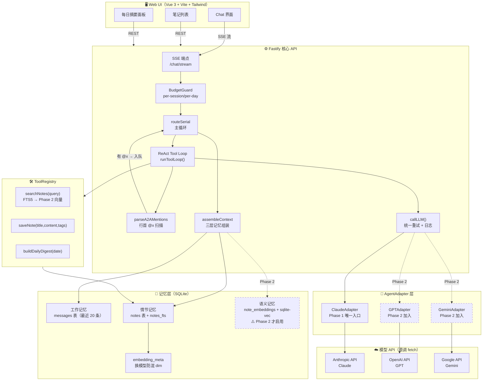
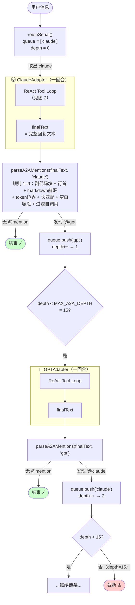
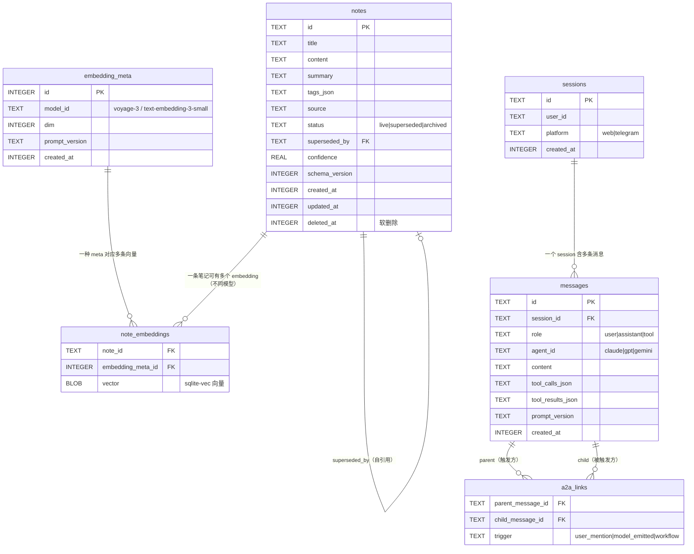
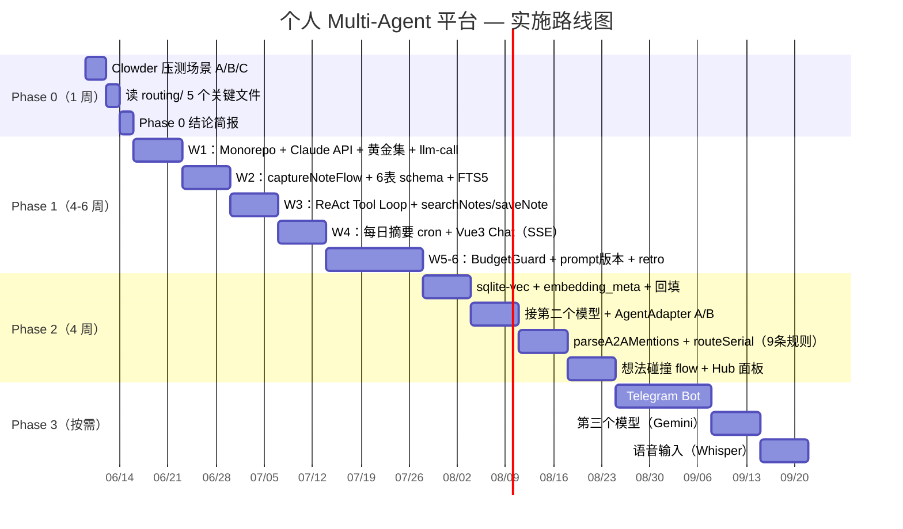
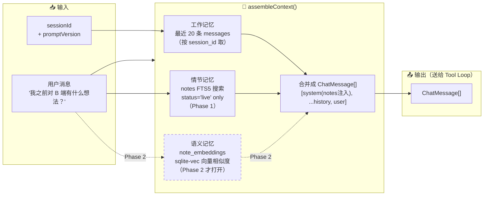

# 我的 Multi-Agent 平台 — 构建计划 v2

> 参考 Clowder AI 架构，从解决自己的问题出发，逐步搭建属于自己的 AI 团队平台。
> 创建于：2026-06-02 | v2 改写于：2026-06-06（修复 prompt-chain ≠ Agent loop 命名错误、Phase 1 排期低估、Clowder 参照失真等 12 项硬伤）

---

## 一、核心目标

**我在解决什么问题？**

碎片化的想法和笔记散落在各处——会议记录、随手写的 idea、读书摘要——但它们之间没有联系，过几周就找不到了，更不知道自己在某个话题上积累了什么。

**这个平台要做到：**

- **碎片输入 → 结构化笔记** — 说一段话，AI 帮你提炼成有标题、要点、标签的笔记
- **跨笔记语义检索** — 问"我对增长策略有什么看法"，AI 检索并综合你过去写的内容
- **想法碰撞** — 你提出新想法，AI 联系已有笔记，找出矛盾点或延伸方向
- **多模型分工** — Claude 负责提炼和写作，GPT 负责批判和反驳，Gemini 负责联想和扩展

### 和现成产品的差距（为什么不直接二开）

| 产品 | 它做得好的 | 我容忍不了的 | 能不能二开 |
|---|---|---|---|
| Notion AI | UI、协作、模板生态 | 单模型、闭源、A2A 不可能、检索是黑盒 | 不能（SaaS） |
| Obsidian Smart Connections | 本地、Markdown、向量检索 | 单 Agent、无 A2A、Plugin 沙盒受限 | 可以但要绕沙盒 |
| Mem.ai | 自动归类、时间轴 | 闭源、模型不可换、价格 | 不能 |
| Reflect | 双链、AI 摘要 | 单模型、无工具调用 | 不能 |
| Clowder AI | 多猫 A2A、Skills、共享记忆 | 笔记工作流不是它的目标域 | **可以——这就是 Phase 0 要验证的** |

> **Phase 0 决策点**：先用 Clowder 现成的 A2A + Skills 跑一周笔记场景。如果够用 → 放弃自建，写 Skill 即可。只有当 Clowder 在"笔记结构化 + 语义检索"上明确不够时，才启动 Phase 1。**自建不是目的，搞懂才是。**

### 项目本质（不要骗自己）

这个项目**不是**"AI 自主决定下一步"，而是两个朴素机制的组合：

```typescript
// 1. Prompt-chained orchestration with model-emitted handoff
//    （模型在输出里写 @who，路由器据此转交——决策权在 prompt 设计，不在 AI"意志"）
const next = parseA2AMentions(reply.text)  // 扫行首 @mention
queue.push(...next)                         // 路由器决定，不是 AI

// 2. 单 cat 内部的 ReAct tool-loop
//    （Thought → Action → Observation 循环，由 LLM provider 的 tool-calling 驱动）
while (response.tool_calls) { /* 执行工具，回喂结果 */ }
```

> **学习目标**：搞懂 LLM 应用工程（prompt 设计、tool-loop、状态管理、检索），并真正看懂 Clowder 在解决什么问题。**不是**产出商业产品，**不是**做出"会思考的 AI"。骗自己说这是 AGI 雏形，会让我写出错误的代码和过度的架构。

---

---

## 二、用户故事（升级 C 为日常高频入口）

> 重写说明：原来 A/B/C 三幕全是"想到了才用"的低频场景，会让平台冷启动失败——
> 没有持续输入，Phase 2 的语义检索就是空架子，自己也演不出任何东西。
> 这一节新增**场景 D：每日 AI 回顾摘要**作为高频钩子，并把 A/B/C 的频率明确标出来，
> 让自己一眼看到"哪一幕是天天用的，哪一幕只是偶尔用"。

### 频率分布一览

| 场景 | 触发方式 | 期望频率 | Phase 1 是否验收 |
|------|---------|---------|----------------|
| A 碎片 → 结构 | 用户主动 | 每周几次 | ✅ |
| B 检索 + 综合 | 用户主动 | 季度 | ❌（依赖 Phase 2 向量检索） |
| C 想法碰撞 | 用户主动 | 月度 | ✅（先跑硬编码版） |
| D 每日 AI 回顾摘要 | **平台主动推送** | **每天** | ✅（Phase 1 必须有） |

> **设计取舍**：B 留到 Phase 2 没问题；A/C/D 必须 Phase 1 就能跑——
> 否则没有日常入口（D 缺位）→ 没有持续语料 → Phase 2 检索做出来也是空的。

---

### 场景 A：碎片 → 结构

> 你在地铁上，刚开完会，打开手机说：
> "今天开会聊了三件事：第一，用户留存问题，可能和 onboarding 有关；第二，下季度要做 B 端；第三，技术债太多要还。"
>
> 平台做什么：
> 1. Claude 解析语音/文字，提取三个独立议题
> 2. 每个议题生成一条笔记：标题 + 要点 + 关联标签
> 3. 自动存入知识库，标记来源（"2026-06-05 会议"）

**结果**：一段话变成三条结构化笔记，不需要你手动整理。

**频率**：每周几次（开完会、读完文章、走路想到事情时）。

---

### 场景 B：检索 + 综合

> 三个月后，你在想增长策略，问：
> "我之前对用户留存有什么想法？"
>
> 平台做什么：
> 1. 语义检索找到 12 条相关笔记（不只是关键词匹配）
> 2. Claude 综合这 12 条，生成一段连贯的总结
> 3. 标注每个观点来自哪条笔记，可点击跳转

**结果**：你不需要记得"那天说过什么"，AI 帮你整理三个月的积累。

**频率**：季度（写复盘、做规划、准备分享时才会主动调用）。

---

### 场景 C：想法碰撞（修订版：必须只引用 live 笔记 + 标 confidence + 主动报冲突）

> 你有个新想法：
> "我觉得应该先做 B 端，B 端收入能养活 C 端增长。"
>
> 平台做什么：
> 1. Claude 在知识库里**只**召回 `status=live` 的相关笔记（已被 supersede 的旧笔记不进上下文）
> 2. GPT 扮演"批评者"：基于召回的 live 笔记找漏洞，每条引用必须附 `confidence(0-1)` 和原始日期
> 3. **冲突主动标记**：如果 GPT 想引用的某条笔记其实已被另一条笔记 supersede，必须在报告里显式标出冲突，而不是装作不知道
> 4. 综合生成"想法碰撞报告"：支持点 + 反对点 + 冲突标记 + 下一步追问

**为什么要硬性要求 status=live + confidence + 冲突标记**：

| 问题 | 不加约束的后果 | 加了约束之后 |
|------|--------------|------------|
| 笔记会被自己后来的想法推翻 | AI 引用半年前已被自己反驳过的旧观点，看起来像"AI 在打脸自己" | 默认只看 live，过期的不进上下文 |
| AI 可能瞎引用 | "你说过 X" 但你其实没说过 | 每条引用挂 noteId + 日期，可点回去核对 |
| AI 不知道哪条更可信 | 一条 2024 年随手写的和一条 2026 年深度复盘的被同等对待 | confidence 由召回相似度 + 笔记新鲜度 + 是否被引用过共同决定 |
| 引用到已被 supersede 的笔记 | 报告内部自相矛盾 | 主动报冲突，要求用户裁决 |

**笔记 status 字段的最小定义**（写进数据模型，Phase 1 就上）：

```typescript
type NoteStatus =
  | 'live'        // 当前有效，可被 AI 引用
  | 'superseded'  // 被另一条笔记取代（需要 supersededBy 指向新笔记）
  | 'archived'    // 用户手动归档，不参与召回

interface Note {
  // ... 原有字段
  status: NoteStatus
  supersededBy?: string  // 指向新笔记 id
}

interface NoteCitation {
  noteId: string
  title: string
  date: string           // 原始创建日期，给用户看时间感
  confidence: number     // 0-1，AI 自评这条引用的可靠程度
  conflictWith?: string  // 如果引用到已 superseded 的笔记，这里写 supersededBy 的 id
}

interface CollisionReport {
  support: { text: string; citations: NoteCitation[] }
  critique: { text: string; citations: NoteCitation[] }
  conflicts: NoteCitation[]   // 主动暴露的冲突清单
  followUps: string[]         // 值得追问的 3 个点
}
```

**召回阶段的硬约束**（Phase 1 就要写对，否则 Phase 2 加向量也救不回来）：

```typescript
async function recallForCollision(idea: string): Promise<Note[]> {
  // 1. 默认只召回 live；superseded / archived 不进入候选集
  const candidates = await db.query(
    `SELECT * FROM notes WHERE status = 'live'`
  )
  // 2. Phase 1 用关键词 + 标签粗排；Phase 2 换成向量
  const ranked = rankByOverlap(candidates, idea)
  return ranked.slice(0, 8)
}

function detectSupersededConflict(
  citations: NoteCitation[],
  allNotes: Map<string, Note>
): NoteCitation[] {
  // AI 输出引用之后，跑一遍校验：
  // 如果它引用的 noteId 在库里已经是 superseded，强制标记 conflictWith
  return citations.flatMap(c => {
    const note = allNotes.get(c.noteId)
    if (note?.status === 'superseded' && note.supersededBy) {
      return [{ ...c, conflictWith: note.supersededBy }]
    }
    return []
  })
}
```

**结果**：AI 不只是执行，而是和你真正"对话"你的想法——并且承认自己引用的来源、暴露内部冲突。

**频率**：月度（有大决定、想检验自己判断时才用）。

---

### 场景 D：每日 AI 回顾摘要（高频入口，Phase 1 验收）

> 早上 8 点你打开平台首页，看到的第一屏不是空白对话框，而是：
>
> > **昨天你写了 4 条笔记**
> >
> > 你昨天主要在想两件事：B 端优先级 和 团队节奏。在 B 端那条上你给了肯定的判断，但和你 3 月 12 日"B 端会拖慢节奏"的笔记有矛盾——这个矛盾还没解。团队节奏的三条笔记都指向同一个根因：周会太长。
> >
> > **3 个值得追问的点：**
> > 1. B 端这次想清楚了到底解决了 3 月那条的哪个顾虑？还是只是改了主意？
> > 2. 周会太长是症状，根因是议程没有 owner 还是参会人太多？
> > 3. 昨天没提到的"技术债"是被搁置了还是已经不重要了？

**这一幕为什么必须放进 Phase 1**：

| 缺它的后果 | 有它的效果 |
|----------|-----------|
| 平台是"想到了才打开"的工具，平均每周打开 1-2 次 | 平台是"早上必看"的工具，每天产生新输入 |
| Phase 2 向量检索没有足够语料可演示 | 持续喂数据，Phase 2 能直接见效 |
| 笔记越积越多但用户从不回看，旧笔记 = 死数据 | 每天被 AI "翻"一次，旧笔记变成活上下文 |
| C 场景的 supersede / 冲突检测没有触发机会（用户根本不会主动整理状态） | D 的"3 个追问"自然引导用户去更新 / supersede 旧笔记 |

**最小实现（Phase 1 就能跑，不需要向量）：**

```typescript
interface DailyDigest {
  date: string            // YYYY-MM-DD，"昨天"
  noteCount: number
  narrative: string       // 一段连贯综述，不是 bullet 堆叠
  followUps: string[]     // 恰好 3 个，多了会让人不想看
  citedNotes: NoteCitation[]
}

async function buildDailyDigest(yesterday: string): Promise<DailyDigest> {
  // 1. 拉昨天创建的所有 live 笔记
  const notes = await db.query(
    `SELECT * FROM notes
     WHERE status = 'live'
       AND date(created_at) = ?`,
    [yesterday]
  )
  if (notes.length === 0) return emptyDigest(yesterday)

  // 2. Phase 1 只让 Claude 一个模型来做（多模型分工是 Phase 2 的事）
  //    Prompt 三件硬约束：
  //    - 必须连贯成段，不允许 bullet
  //    - 必须输出恰好 3 个追问
  //    - 引用必须附 noteId，方便前端点回去
  const response = await claudeAdapter.invoke([
    { role: 'system', content: DAILY_DIGEST_SYSTEM_PROMPT },
    { role: 'user', content: formatNotesForDigest(notes) }
  ])

  return parseDigestResponse(response, notes)
}

// 触发方式：Phase 1 不上 cron，先用"用户每日首次打开"惰性触发
async function getDigestOnAppOpen(userId: string): Promise<DailyDigest> {
  const yesterday = formatDate(subDays(new Date(), 1))
  const cached = await db.getDigest(userId, yesterday)
  if (cached) return cached
  const digest = await buildDailyDigest(yesterday)
  await db.saveDigest(userId, digest)
  return digest
}
```

> **Phase 1 取舍**：
> - 单模型（Claude）就够，不要在 D 上演"三模型分工"——感知层多模型只是包装，Phase 1 不验收这个
> - 不上 cron，用"首次打开惰性触发 + 缓存"，避免一开始就引入定时任务的可观测性 / 重试 / 成本上限问题
> - 摘要本身不入库为 Note，单独存 `daily_digests` 表，避免污染笔记空间

**Phase 1 验收标准（D 必须满足）：**

- [ ] 给定一组昨天的笔记 → 产出一段连贯综述（不是 bullet 列表）
- [ ] 产出**恰好 3 条**追问，不能多也不能少
- [ ] 每个引用挂 noteId + 日期，前端可点回原笔记
- [ ] 昨天 0 条笔记时，给一条温和提示而不是报错或空白
- [ ] 同一天再次打开，直接读缓存，不重新调 LLM（成本上限）

**频率**：每天（这是整个平台的高频入口和数据飞轮起点）。

---

---

## 三、架构设计

> **本节是整篇文档的"心脏"，也是评审里被打得最疼的地方。**
> 上一版把 prompt-chaining + 字符串路由 包装成了"A2A 自主路由 / Agent 自主性"——这是误导。
> 这一版把名字还原成它实际是的样子，并补上一条之前缺失的主轴：**单 Cat 内的 ReAct Tool Loop**。
> 没有 tool loop，就没有 Agent；只有 prompt-chaining，没有自主性。

### 3.0 两条主轴

整个平台只有两条循环。理解了这两条，剩下的全是 plumbing：

| 主轴 | 谁在循环 | 终止条件 | 体现的能力 |
|------|---------|---------|-----------|
| **ReAct Tool Loop**（单 Cat 内） | 一只 Cat 反复调用 `tool_use` → 执行工具 → 把 `tool_result` 喂回去 | 模型这一回合不再发出 `tool_use`（即 `stop_reason` 收敛到 `end_turn`），或达到 `MAX_TOOL_LOOP_ITERATIONS` | Agent 真正的"自主性"——它自己决定要不要查、查什么、查够了没 |
| **Prompt-Chained Orchestration**（跨 Cat） | Router 串行调度多只 Cat | 当前 Cat 输出里没有行首 `@x`，或达到 `MAX_A2A_DEPTH` | 一种**模型发出 handoff 信号、外部代码做字符串匹配后调度**的协作模式 |

> **诚实命名**：第二条不是"Agent 自主路由"。它是 **Prompt-Chained Orchestration with Model-Emitted Handoff** ——
> 我在 system prompt 里教模型"如果你觉得该换人，就在行首写 `@gpt`"，
> 然后我在外面写 30 行字符串扫描代码看到 `@gpt` 就把任务交给 GPT。
> 模型的"自主"只到"决定写不写这个字符串"为止；真正在循环里跑的是**我的代码**，不是模型。
> 这件事和 ReAct Tool Loop 的差距，是**这次重写的全部动机**。

### 3.1 三层结构

```
平台层（我要建的）
├── 路由层
│   ├── Prompt-Chained Handoff 解析（行首 @x → 下一只 Cat）
│   └── Router 主循环（串行调度，带 depth 上限）
├── 工具循环层（ReAct）
│   ├── AgentAdapter 流式产出 tool_use / text / tool_result
│   ├── ToolRegistry：searchNotes / saveNote / ...
│   └── Tool Loop 主循环（带 MAX_TOOL_LOOP_ITERATIONS 上限）
├── 记忆层
│   ├── 工作记忆：本回合 messages + 本回合 tool 调用历史
│   ├── 情节记忆：SQLite notes 表（持久）
│   └── 语义记忆：sqlite-vec embedding（Phase 2）
└── 编排层：硬编码 flow（Phase 1）→ YAML SOP（Phase 2）

模型层（直接调 API）
├── Anthropic API（Claude）
├── OpenAI API（GPT）
└── Gemini API（Gemini）
```

### 3.2 MVP 系统架构图

```
┌────────────────────────────────────────────────────────┐
│              Web UI（Vue 3 + Vite + Tailwind）          │
└──────────────────────────┬─────────────────────────────┘
                           │ WebSocket（流式 chunks）
┌──────────────────────────▼─────────────────────────────┐
│                 Fastify 核心 API                        │
│                                                        │
│   用户消息                                              │
│      │                                                 │
│      ▼                                                 │
│   ┌─────────────────────────────────────────────┐      │
│   │       Router 主循环（routeSerial）          │      │
│   │   while queue 非空 && depth < MAX_A2A_DEPTH │      │
│   └─────────────────────┬───────────────────────┘      │
│                         │ 取出下一只 cat                │
│                         ▼                              │
│   ┌─────────────────────────────────────────────┐      │
│   │     AgentAdapter.invoke (单 Cat 一回合)      │      │
│   │                                             │      │
│   │   ┌───────────────────────────────────┐     │      │
│   │   │      ReAct Tool Loop              │     │      │
│   │   │   while iter < MAX_TOOL_LOOP:     │     │      │
│   │   │     stream 模型输出               │     │      │
│   │   │     if chunk.type == 'tool_use':  │     │      │
│   │   │        run tool → 'tool_result'   │     │      │
│   │   │        push 回 messages，再 stream│     │      │
│   │   │     elif 只有 text: break         │     │      │
│   │   └───────────────────────────────────┘     │      │
│   │            │                                │      │
│   │            ▼                                │      │
│   │     最终 assistant text                      │      │
│   └─────────────────────┬───────────────────────┘      │
│                         │                              │
│                         ▼                              │
│   ┌─────────────────────────────────────────────┐      │
│   │  parseA2AMentions(finalText, currentCat)    │      │
│   │  - 剥离 fenced code blocks                  │      │
│   │  - 行首 @x（带 markdown 前缀容忍）           │      │
│   │  - token 边界 + 长匹配优先                   │      │
│   │  - 过滤自调用                                │      │
│   │  - 上限 MAX_A2A_MENTION_TARGETS=2           │      │
│   └─────────────────────┬───────────────────────┘      │
│                         │ 0 个 mention → 终止           │
│                         │ ≥1 个 → push queue, depth++   │
│                         ▼                              │
│                   回到 Router 主循环                    │
└────────────────────────────────────────────────────────┘
                           │
              ┌────────────┼────────────┐
              ▼            ▼            ▼
          Claude API   GPT API     Gemini API
```

> **看图记两件事：**
> 1. **内层是 ReAct Tool Loop**，模型自己决定调不调工具 —— 这是 Agent 原理的核心。
> 2. **外层是 Prompt-Chained Handoff**，Router 在做字符串匹配 —— 这不是模型自主，是我教的协议。

### 3.3 主轴 A：单 Cat 内的 ReAct Tool Loop

这是 Phase 1 必须跑通的"Agent 原理"最小可验证证据。
**没有 tool loop 跑通，Phase 1 验收不算过。**

#### 3.3.1 AgentAdapter 接口（带 tool 的版本）

```typescript
// AgentChunk 是流式输出的最小单元，至少 3 种
type AgentChunk =
  | { type: 'text'; delta: string }
  | { type: 'tool_use'; id: string; name: string; input: unknown }
  | { type: 'tool_result'; toolUseId: string; output: unknown; isError?: boolean }

interface AgentAdapter {
  id: 'claude' | 'gpt' | 'gemini'
  // 注意：invoke 一次返回的不是"模型说的话"，而是"这一回合的 tool loop 全过程"
  invoke(
    messages: ChatMessage[],
    tools: ToolDef[],
  ): AsyncIterable<AgentChunk>
}

interface ToolDef {
  name: string
  description: string
  inputSchema: unknown   // JSON Schema，供模型参考
  run(input: unknown): Promise<unknown>
}
```

#### 3.3.2 Tool Loop 主循环（约 30 行）

```typescript
// 这是单 Cat 一回合内部的 ReAct 循环。
// 调用方拿到的 AsyncIterable<AgentChunk> 是这个 generator 流出的所有 chunk。
//
// 注意：ProviderClient 是更底层的"裸 SDK 包装"——直接调 Anthropic/OpenAI/Gemini SDK
// 拿一次性的 stream，本身不带循环。runToolLoop 才是把 ProviderClient 串成
// AgentAdapter.invoke 的那一层。lastAssistantBlocks() 是辅助函数，把当轮 stream
// 已发出的 text + tool_use 块拼成 assistant message 用来落 messages 历史。
async function* runToolLoop(
  adapter: ProviderClient,         // 直接包 Anthropic/OpenAI SDK，无循环
  tools: ToolDef[],
  messages: ChatMessage[],
): AsyncIterable<AgentChunk> {
  const toolByName = new Map(tools.map(t => [t.name, t]))
  for (let iter = 0; iter < MAX_TOOL_LOOP_ITERATIONS; iter++) {
    const pendingToolUses: { id: string; name: string; input: unknown }[] = []

    // 1. 流式拿模型这一步的输出（text 和 tool_use 混在一起）
    for await (const chunk of adapter.stream(messages, tools)) {
      yield chunk                                       // text 直接转发到 UI
      if (chunk.type === 'tool_use') pendingToolUses.push(chunk)
    }

    // 2. 这一步没要工具 → 模型说完了，跳出
    if (pendingToolUses.length === 0) return

    // 3. 把 assistant 这一轮（含 tool_use）落进 messages
    messages.push({ role: 'assistant', content: lastAssistantBlocks() })

    // 4. 串行执行工具，把每个 tool_result 既 yield 给上游、也喂回 messages
    for (const tu of pendingToolUses) {
      const tool = toolByName.get(tu.name)
      const output = tool ? await tool.run(tu.input) : { error: 'unknown tool' }
      const resultChunk: AgentChunk = { type: 'tool_result', toolUseId: tu.id, output }
      yield resultChunk
      messages.push({ role: 'tool', toolUseId: tu.id, content: output })
    }
    // 5. 回到 for 顶部，让模型基于 tool_result 继续推理
  }
  // 跑到 MAX_TOOL_LOOP_ITERATIONS 还没收敛 → 由上层决定是否截断
}
```

> **关于 `MAX_TOOL_LOOP_ITERATIONS`**：Anthropic / OpenAI / Gemini 的官方 SDK 一次 `messages.create` 或 `stream` 调用本身**不做循环**（它只产出"这一回合"的输出），循环和上限都得我自己写。所以这里的 cap 不是"覆盖 SDK 默认值"，是"自己造的循环要自己设防爆"。

> **Phase 1 的 Agent 验证（不可省）：**
> 注册两个工具 `searchNotes(query)` 和 `saveNote({title, content, tags})`，给 Claude 一句**故意需要两跳**的话：
> "把我刚说的'B 端优先'整理成笔记，但先看看我之前对 B 端有没有写过什么。"
> 期待看到的 chunk 序列：
> `tool_use(searchNotes)` → `tool_result` → `text("找到 3 条相关...")` → `tool_use(saveNote)` → `tool_result` → `text("已保存")`
> 这串序列出现一次，"我懂 Agent 是怎么自己干活的" 才算 落地。
> 出不来，这一节都白写。

### 3.4 主轴 B：Prompt-Chained Orchestration with Model-Emitted Handoff

> **这一节就是上一版的"A2A 自主路由"——改名是为了不再骗自己。**

#### 3.4.1 它是什么

```
我做的事：
  1. 在每只 Cat 的 system prompt 里写：
     "如果你觉得这个问题应该换 @gpt 处理，就在回复的某一行行首写 `@gpt`。"
  2. Cat 回复完整结束后，我用正则扫描整段输出。
  3. 看到行首 @gpt → 把上下文打包发给 GPT。
  4. 直到没人写 @x，或 depth 超上限。

模型做的事：
  仅仅是"决定要不要在某一行行首写一个字符串"。

这不是 Agent 自主性。
这是 prompt-chaining + 一段字符串扫描代码。
但它依然有用——它让多模型协作成为可能，而不需要我硬编码 if/else。
```

#### 3.4.2 简化版 routeSerial

```typescript
// 教学版：约 30 行能讲清主循环。
// 真实 packages/api/src/domains/cats/services/agents/routing/route-serial.ts 是 2376 行
// —— 那 2300+ 行不是"过度工程"，详见 §3.6 我故意不做的复杂度。
async function routeSerial(initialMessage: string, ctx: RequestContext) {
  const queue: CatId[] = [ctx.defaultCat ?? 'claude']
  const tools = buildToolsFor(ctx)
  let depth = 0

  while (queue.length > 0 && depth < MAX_A2A_DEPTH) {
    const catId = queue.shift()!
    const adapter = getAdapter(catId)
    const messages = buildMessagesFromHistory(ctx, catId)

    // 单 Cat 一回合 = 一整轮 ReAct Tool Loop（§3.3）
    let finalText = ''
    for await (const chunk of adapter.invoke(messages, tools)) {
      if (chunk.type === 'text') finalText += chunk.delta
      ctx.stream.send(catId, chunk)              // 流到 UI
    }
    ctx.history.push({ catId, content: finalText })

    // Prompt-Chained Handoff：扫描文本里的行首 @x
    const nextCats = parseA2AMentions(finalText, catId)
    queue.push(...nextCats)
    depth++
  }
}
```

#### 3.4.3 parseA2AMentions 真实细节（对齐 a2a-mentions.ts）

上一版我列了"四点"，是错的。对齐 `packages/api/src/domains/cats/services/agents/routing/a2a-mentions.ts` 的真实规则。**前 9 条都在 `parseA2AMentions` 内部**；第 10 条是它的兄弟模块 `a2a-shadow-detection.ts`（`detectInlineActionMentions`）的职责，列在这里是因为读源码会立刻撞到、不知道就拼不出全貌：

| # | 规则 | 所属模块 | 为什么 |
|---|------|---------|------|
| 1 | 剥离 fenced code blocks（``` ``` 内不算 mention） | parseA2AMentions | 避免代码注释里的 `@gpt` 误触发 |
| 2 | 仅匹配**行首** mention，允许前导空白 | parseA2AMentions | 行中间的 `@gpt` 是叙述，不是 handoff |
| 3 | 容忍行首 markdown 前缀：`> ` 引用、`-/*/+ ` 列表、`1. ` / `1) ` 有序列表 | parseA2AMentions | LLM 经常在列表里写 handoff（源码 regex `\d+[.)]` 同时支持点和右括号） |
| 4 | **token 边界**：`@opus-45` 不会误命中 `@opus` | parseA2AMentions | 长 handle 优先，避免子串误匹配 |
| 5 | **长匹配优先**：先匹配最长的 handle | parseA2AMentions | 同上 |
| 6 | **空白容忍**：`@ gpt` / `@\ngpt` 仍能识别 | parseA2AMentions | 模型偶尔会断字 |
| 7 | 过滤自调用（Claude 不能 @claude 自己） | parseA2AMentions | 防止单 Cat 死循环 |
| 8 | 单条消息上限 `MAX_A2A_MENTION_TARGETS = 2` | parseA2AMentions | 防止扇出失控 |
| 9 | F182：被 disable 的 cat 被 @ 时返回 `routing_warnings`，不路由 | parseA2AMentions | 配置安全 |
| 10 | inline shadow detection（行中间 + handoff 动词的 @x 也记一笔，但不路由） | **`a2a-shadow-detection.ts` / `detectInlineActionMentions`**（兄弟模块） | 留 telemetry，调 prompt 用 |

> **上一版列的"四点"省略了 6/7/8/9/10——这些不是边角料，是真实数据里出错最多的地方。**
> Phase 1 至少要把 1-5 + 7 + 8 实现出来，9/10 可以留 TODO：
> - 规则 9 是配置变更兜底，单人 MVP 阶段所有 cat 都 enabled，先静默跳过没事；
> - 规则 10 是 telemetry/调 prompt 用的副产物，不实现也不影响主流程；
> - 规则 6（空白容忍）严格说是"LLM 偶尔断字"的健壮性补丁，没遇到不写也行——但实现成本就一个 `\s*` 间插，建议顺手写了。

### 3.5 安全边界（真实数字，对齐源码）

| 常量 | 值 | 出处 / 备注 |
|------|----|-----------|
| `MAX_A2A_DEPTH` | 默认 **15**（env 可覆盖） | `a2a-mentions.ts: getMaxA2ADepth()` —— 上一版写的 5 是错的 |
| `MAX_A2A_MENTION_TARGETS` | **2** | `a2a-mentions.ts` 常量，单条消息最多 @ 两只猫 |
| `MAX_TOOL_LOOP_ITERATIONS` | **建议 8–12**（自定，Phase 1 取 10） | 防止模型在工具上死循环；SDK 一次调用本身不循环，循环和上限都是我自己写的，得自己设 cap |
| 行首 mention 才路由 | — | 见 §3.4.3 规则 2 |
| 过滤自调用 | — | 见 §3.4.3 规则 7 |
| fenced code 内不算 | — | 见 §3.4.3 规则 1 |

> **15 不是 5——这个数字差距决定了你能不能走通"Claude → GPT → Claude → Gemini → Claude"这种四五跳的真实链。** 上一版写 5 是因为我没读源码就拍脑袋。

### 3.6 我故意不做的复杂度（与真实 Clowder 的差距）

routeSerial 简化版 ~30 行，真实 `route-serial.ts` 是 **2376 行**。差出来的不是冗余，是兜底。
Phase 1 不做，但要知道丢了什么、什么场景会咬到我：

| 真实 Clowder 模块 | 它解决的问题 | 我 Phase 1 不做的代价 |
|-------------------|------------|-------------------|
| `MultiMentionOrchestrator.ts` | 单条消息 @ 多只猫时的并行调度与回流合并 | 我只支持串行，多 mention 时只取前 1 个 |
| `context-transport.ts` | 跨猫的上下文裁剪/打包（不把 A 的全量历史灌给 B） | 我会把全量历史塞下一只猫，token 浪费且互相污染 |
| `ContextAssembler.ts` | system prompt + 记忆 + 工具说明的统一组装 | 我每个 adapter 自己拼，容易 prompt drift |
| `verdict-detect.ts` / `void-hold-detect.ts` | 检测"已下结论 / 当前被挂起"的状态机信号 | 我会出现两只猫互相把球踢回来无法收尾 |
| `WorklistRegistry.ts` | 跨进程/跨 thread 的待办登记，断电恢复 | 我进程崩了任务丢 |
| `multi-mention-state-machine.ts` | 多猫并发时的状态收敛 | 同 MultiMentionOrchestrator |
| F182 disabled-cat 警告路径 | 配置变更时的兜底告知 | 我直接静默跳过被 disable 的猫 |
| `a2a-shadow-detection.ts`（inline shadow） | 行中间 @x 的 telemetry 记录 | 我看不见模型在行中间提到了别的猫，调 prompt 难 |

> **原则**：Phase 1 跑通 §3.3 + §3.4 就够拿到"Agent 原理"。
> 上面这些**等真实场景咬到我**再补——咬到之前先去读对应文件，不要拍脑袋自己重发明。

### 3.7 框架边界：LangGraph / LangChain 管什么

```
LangGraph 管：单 Cat 内 Tool Loop 的状态可视化
  StateGraph 节点：[stream] → [check_tool_use] → [run_tool] → 回到 [stream]
  这条循环就是 §3.3 的 runToolLoop，画成图便于断点观察

  跨 Cat 的 Prompt-Chained Handoff 也可以用 StateGraph 画，
  但条件边里的 parseA2AMentions 完全自己实现（参考 a2a-mentions.ts）

LangChain 管：工具和向量层的胶水
  - Tool 定义结构（仅借用 Schema 形态）
  - Embeddings（OpenAI / Anthropic）
  - 不用 AgentExecutor / Chain —— 那层把 tool loop 黑盒化，
    会让我"用了 Agent 但没看见 Agent" —— 这正是上一版犯的病

我自己写：
  - parseA2AMentions（§3.4.3 的 9 条规则 + 兄弟模块 a2a-shadow-detection 的第 10 条）
  - runToolLoop（§3.3.2）
  - routeSerial 主循环（§3.4.2）
  - AgentAdapter 接口 + 三个 provider 实现
```

---

> **本节小结（一句话回 §3.0 的两条主轴）：**
> ReAct Tool Loop 让单只猫**有自主性**；Prompt-Chained Handoff 让多只猫**会传球**。
> 前者是 Agent，后者是 orchestration —— 不要再把第二个叫成第一个。

---

## 四、关键设计决策

> 这一节是在第一版评审之后重写的。原来把 prompt-chaining 写成了"Agent 自主路由"，把 manifest.yaml 当成了工作流真相源，把记忆三层指针指到了底层存储文件——都改了。诚实记一下：错过的事比对的事更值得留底。

### 4.1 核心抽象：AgentAdapter 接口（升级版）

第一版只让 Adapter 吐 `string`，结果 tool-use 一上来就接不住。现在升级：Adapter 必须吐**带类型的 chunk 流**，把 text / tool-call / tool-result 三种事件分开，Router 才能识别"模型现在在调工具，不要急着判 A2A mention"。

```typescript
// chunk 三件套：text 是给用户看的，tool_use 是给工具调度器的，tool_result 是回灌
interface TextChunk { type: 'text'; delta: string }
interface ToolUseChunk {
  type: 'tool_use'
  id: string                 // 模型给这次调用的 id
  name: string               // 工具名（searchNotes / saveNote / ...）
  inputDelta?: string        // 流式拼接的 JSON 片段
  input?: unknown            // 完整 input（流式结束时给）
}
interface ToolResultChunk {
  type: 'tool_result'
  toolUseId: string          // 回指 ToolUseChunk.id
  content: string            // 工具执行结果（JSON 字符串或文本）
  isError?: boolean
}
type AgentChunk = TextChunk | ToolUseChunk | ToolResultChunk

interface ChatMessage {
  role: 'system' | 'user' | 'assistant' | 'tool'
  content: string
  tool_calls?: Array<{ id: string; name: string; input: unknown }>   // assistant 发出的工具调用
  tool_results?: Array<{ toolUseId: string; content: string; isError?: boolean }>  // tool 角色回灌
}

interface AgentAdapter {
  id: 'claude' | 'gpt' | 'gemini'
  name: string
  invoke(messages: ChatMessage[], opts?: { tools?: ToolSchema[]; signal?: AbortSignal }): AsyncIterable<AgentChunk>
}
```

> **为什么先升级这层**：Phase 2 要做语义检索 + 笔记综合，那必然走 tool-use 闭环（模型自己决定什么时候调 `searchNotes`）。如果 Adapter 还是只会吐字符串，整个 tool-loop 要回头重写。这是少数"现在不做、以后还债更贵"的地方。
> **Clowder 参考**：`packages/api/src/domains/cats/services/agents/providers/`（`ClaudeAgentService.ts` / `GeminiAgentService.ts` / `CodexAgentService.ts` 等）——它们也是 chunk 流接口（`async *invoke(...): AsyncIterable<AgentMessage>`），但签名是单 prompt 字符串入。我的 MVP 把入参升级为 `messages[]`、把出参细分成 `text / tool_use / tool_result` 三类——形态参考 Clowder，但不是照搬。

### 4.2 路由策略：Model-Emitted Handoff（不是自主性）

第一版叫"A2A 自主路由"，写完才意识到这名字撒了谎——模型在文本结尾打个 `@gpt`，路由器读字符串决定下一跳，本质是 **prompt-chaining + 字符串协议**，不是模型在做规划。改名 **Model-Emitted Handoff（模型发起的交接）**，老老实实承认这是协议，不是 agency。

| | 用户 @mention | Model-Emitted Handoff | 真正的 Agent 自主性 |
|--|--|--|--|
| 谁决定下一步 | 用户 | 模型在输出里写 `@xxx`，路由器解析 | 模型有 goal + planning + self-critique loop |
| 体现的能力 | 工具调用 | 协议遵从（按 prompt 模板写 mention） | 任务分解、错误恢复、工具循环 |
| Phase 1 要做吗 | 是 | **否，推迟到 Phase 2** | 否，Phase 3 之后才碰 |

**模型角色分工（重要修正）：**

```
Claude  → 提炼结构、生成笔记、综合总结（默认入口）
GPT     → 批判思维、找漏洞、反驳观点
Gemini  → 联想扩展、头脑风暴、跨领域连接
```

> **Phase 1 只接 Claude 一家。** 三模型分工写出来好看，但感知层只是包装不同 API——Phase 1 就接三家，你分不清"GPT 反驳更犀利"是模型差异还是 prompt 差异，调试时也没法控制变量。
> 多模型推迟到 **Phase 2 末尾**，并且要做 A/B 测试：同一份笔记 + 同一个"找漏洞"prompt，分别喂 Claude / GPT，人工评分 20 个样本，看差异是不是真的来自模型。如果差异主要来自 prompt，那一开始就该 Claude 一家用三套 system prompt，不必上三家 API。

> **Clowder 参考**：`packages/api/src/domains/cats/services/agents/routing/route-serial.ts`、`a2a-mentions.ts`（注意：Clowder 默认 `MAX_A2A_DEPTH = 15`，我抄过来时改成了 5——这是我自己的保守选择，不是 Clowder 原版）

### 4.3 笔记数据模型：6 张表 + FTS5

第一版只画了 3 张表（notes / messages / workflows），没想清楚两件事：**embedding 不能和 note 表混在一起**（换模型就要重算，不能丢业务字段），**笔记会被改写但不能丢历史**（status + supersededBy）。重画。

```sql
-- 笔记主表：业务字段 + 软删除 + 版本/状态
CREATE TABLE notes (
  id              TEXT PRIMARY KEY,
  title           TEXT NOT NULL,
  content         TEXT NOT NULL,
  summary         TEXT,
  tags_json       TEXT,                              -- JSON array of strings
  source          TEXT,
  status          TEXT NOT NULL DEFAULT 'live',      -- 'live' | 'superseded' | 'archived'
  superseded_by   TEXT REFERENCES notes(id),         -- 被哪条新笔记替代
  confidence      REAL,                              -- 0.0-1.0，AI 提炼的置信度
  schema_version  INTEGER NOT NULL DEFAULT 1,        -- 数据迁移用
  created_at      INTEGER NOT NULL,
  updated_at      INTEGER NOT NULL,
  deleted_at      INTEGER                            -- 软删除，不真删
);
CREATE INDEX idx_notes_status ON notes(status) WHERE deleted_at IS NULL;

-- embedding 单独一张表：换模型只动这里，notes 不动
CREATE TABLE note_embeddings (
  note_id         TEXT NOT NULL REFERENCES notes(id) ON DELETE CASCADE,
  embedding_meta  INTEGER NOT NULL REFERENCES embedding_meta(id),
  vector          BLOB NOT NULL,                     -- sqlite-vec 向量
  PRIMARY KEY (note_id, embedding_meta)
);

-- embedding 的"指纹"：换模型/换维度/换 prompt 都新增一行，老向量不删
CREATE TABLE embedding_meta (
  id              INTEGER PRIMARY KEY AUTOINCREMENT,
  model_id        TEXT NOT NULL,                     -- 'voyage-3' / 'text-embedding-3-small'
  dim             INTEGER NOT NULL,
  prompt_version  TEXT NOT NULL,                     -- 'v1' / 'v2-with-tags'
  created_at      INTEGER NOT NULL,
  UNIQUE(model_id, dim, prompt_version)
);

-- 会话与消息：和 Clowder 一样，session 是 trace 单位
CREATE TABLE sessions (
  id              TEXT PRIMARY KEY,
  user_id         TEXT,
  platform        TEXT NOT NULL,                     -- 'web' | 'telegram'
  created_at      INTEGER NOT NULL
);
CREATE TABLE messages (
  id              TEXT PRIMARY KEY,
  session_id      TEXT NOT NULL REFERENCES sessions(id),
  role            TEXT NOT NULL,                     -- 'user' | 'assistant' | 'tool'
  agent_id        TEXT,                              -- 'claude' / 'gpt' / 'gemini' / null
  content         TEXT NOT NULL,
  tool_calls_json TEXT,
  tool_results_json TEXT,
  created_at      INTEGER NOT NULL
);
CREATE INDEX idx_messages_session ON messages(session_id, created_at);

-- A2A 链路：哪条消息触发了哪条消息（Phase 2 用，Phase 1 留空）
CREATE TABLE a2a_links (
  parent_message_id TEXT NOT NULL REFERENCES messages(id),
  child_message_id  TEXT NOT NULL REFERENCES messages(id),
  trigger           TEXT NOT NULL,                   -- 'user_mention' | 'model_emitted' | 'workflow'
  PRIMARY KEY (parent_message_id, child_message_id)
);

-- FTS5 全文检索：Phase 1 没向量也能用关键字搜
CREATE VIRTUAL TABLE notes_fts USING fts5(
  title, content, summary, tags,
  content='notes', content_rowid='rowid'
);
```

```typescript
interface Note {
  id: string
  title: string
  content: string
  summary: string
  tags: string[]
  source: string
  status: 'live' | 'superseded' | 'archived'
  supersededBy?: string
  confidence?: number
  schemaVersion: number
  createdAt: Date
  updatedAt: Date
  deletedAt?: Date
}
```

> **为什么把 embedding 拆出去**：Phase 2 一定会换 embedding 模型（voyage / openai / 国产），如果向量塞在 notes 里，每换一次都要全表回填。拆成独立表 + `embedding_meta` 指纹，换模型时新增一行 meta、后台慢慢回算，老向量还能继续服务旧查询。
> **为什么加 status/supersededBy**：场景 C（想法碰撞）跑完之后会生成"修订版笔记"，旧版不能删（要回看演化），但搜索时不希望出来——`status='superseded'` + 指向新版，前端按需过滤。
> **为什么先加 FTS5**：Phase 1 没 embedding，但用户已经会问"我之前对 onboarding 怎么说的"——FTS5 关键字检索零成本，比纯 LIKE 强一档。

### 4.4 记忆三层架构：分层逻辑在 Assembler，不在 Store

第一版指针指错了文件。`RedisMessageStore.ts` 是 Clowder 的**底层存储后端**（一个 KV-ish 接口），它根本不管"哪些消息进上下文"。真正的分层逻辑在两个地方：

| 层 | Phase 1 实现 | Clowder 对应文件 |
|--|--|--|
| 工作记忆（最近 N 轮） | SQLite `messages` 表，按 `session_id` 取最新 N 条 | `packages/api/src/.../context/ContextAssembler.ts`（`DEFAULT_MAX_MESSAGES = 20` 的出处） |
| 情节记忆（笔记 + 历史） | SQLite `notes` 表 + 关键字 FTS | （Phase 1 不参考 Clowder，自建） |
| 语义记忆（向量） | Phase 2 用 `note_embeddings` + sqlite-vec | `packages/api/.../routing/context-transport.ts`（burst / anchors / coverage map 的滑窗策略） |

```typescript
// Phase 1 极简版：先把"分层"作为函数边界画出来，逻辑可以很简单
async function assembleContext(sessionId: string, userInput: string): Promise<ChatMessage[]> {
  const working   = await db.recentMessages(sessionId, 20)        // 工作记忆：最近 20 条
  const episodic  = await db.searchNotesFTS(userInput, 5)         // 情节记忆：FTS 命中前 5
  // const semantic  = await vec.search(userInput, 5)             // 语义记忆：Phase 2 才打开
  return [
    { role: 'system', content: renderSystem({ notes: episodic }) },
    ...working,
    { role: 'user', content: userInput },
  ]
}
```

> **Clowder 参考**（重新指对）：
> - `packages/api/src/.../context/ContextAssembler.ts`——三层组装的真相源，`DEFAULT_MAX_MESSAGES = 20` 这个魔法数就是从这里抄的
> - `packages/api/.../routing/context-transport.ts`——burst（突发段）、anchors（锚点消息）、coverage map（覆盖图）三种策略，决定多 mention 场景下"每只猫看到什么"
> - `RedisMessageStore.ts` **只是底层存储后端**，不是分层逻辑——第一版指错了，这版改正

### 4.5 工作流引擎：sop-definitions 是状态机，manifest 是路由表

第一版把 `manifest.yaml` 当成"工作流 schema 参考"，错了。Clowder 那边这两个文件职责完全不同（注意路径：`sop-definitions/` 在仓库**根目录**，不在 `cat-cafe-skills/` 下面——`manifest.yaml` 文件头注释自己也写明了这一点）：

| 文件 | 职责 | 内容 |
|--|--|--|
| `sop-definitions/development.yaml`（仓库根目录） | **SOP 真相源**——开发 SOP 的状态机 | `stages`（阶段列表）+ `hard_rules`（每阶段的 blocker 规则）+ `pitfalls`（常见坑，多为 warn 级） |
| `cat-cafe-skills/manifest.yaml` | **skill 路由表**——关键词到 skill 的映射 | `triggers`（触发短语）→ `skill`（要加载的 skill 包） |

一个是"状态机定义"（你处于 impl 阶段，必须满足 `impl-main-sync-before-worktree`、`impl-redis-6398-only` 这类 hard rule，否则推不出去），一个是"关键词路由"（用户说"开个新功能"就加载 `feat-lifecycle` skill）。Phase 2 我要抄的是**前者**的状态机思想；后者更像 Phase 3 多入口时才会用到的 router 配置。

```typescript
// Phase 1：硬编码先跑通，函数边界对应未来的 stage
async function captureNoteFlow(input: string, ctx: RequestContext): Promise<Note> {
  const stream = claudeAdapter.invoke([
    { role: 'system', content: NOTE_SYSTEM_PROMPT_V1 },
    { role: 'user', content: input },
  ])
  const text = await collectText(stream)
  return parseAndSaveNote(text, { sessionId: ctx.sessionId, promptVersion: 'v1' })
}
```

```yaml
# Phase 2：参考 sop-definitions/development.yaml 的状态机风格
# workflows/idea-collision.yaml
id: idea-collision
schema_version: 1
stages:
  - id: search
    type: memory_search
    next: support
  - id: support
    agent: claude
    prompt: prompts/collision-support.v2.md     # prompt 走文件 + 版本号
    next: critique
  - id: critique
    agent: gpt
    prompt: prompts/collision-critique.v1.md
    next: done
pitfalls:
  - "support 和 critique 不要共享上下文，否则 GPT 会被 Claude 的论据带偏"
```

> **Clowder 参考**：
> - `sop-definitions/development.yaml`（仓库根目录）——`stages` + `hard_rules` + `pitfalls` 的状态机真相源（我的工作流引擎抄这个）
> - `cat-cafe-skills/manifest.yaml`——`triggers` → `skill` 的关键词路由表（Phase 3 多入口时再抄）
> - 顺手记一笔：`manifest.yaml` 文件头自己写着「SOP stage / suggested skill / hard rules / pitfalls 的机器真相源是 sop-definitions/development.yaml」——第一版把这俩搞反了，这版纠正。

### 4.6 会话上下文：sessionId + promptVersion 一起贯穿

`RequestContext` 保留，但加一个字段，原因下面解释：

```typescript
interface RequestContext {
  sessionId: string         // 贯穿 Router → Adapter → Memory → Log 的 trace key
  promptVersion: string     // 当前请求用的 system prompt 版本，'v1' / 'v2-with-tags'
  userId?: string
  platform: 'web' | 'telegram'
}
```

> **为什么 promptVersion 必须从一开始就传**：Phase 2 多模型 A/B 测试的时候，你会同时跑 `prompt v1` + `prompt v2`，如果不在请求上下文里带版本号，回头看日志只看到"输出质量下降"，根本不知道是哪一版 prompt 在跑、和哪个模型组合在一起。Phase 1 看似只有一版，但你**一定**会改 prompt——第二天就改——所以从第一行代码就把它当一等公民传下去，比 Phase 2 再补字段、再回填历史日志便宜十倍。
> **sessionId 的含义没变**：它是 trace key，从 WS 入口一路传到 Adapter 调用、Memory 读写、日志埋点，所有地方都按 sessionId 串起来。Phase 2 加 OpenTelemetry 时，`sessionId` 直接当 `trace_id` 用。

---

## 五、技术选型

> **Phase 1 的取舍原则**：先纯函数 + 直调 API 把原理跑通，框架（LangGraph / LangChain）等到自己写的代码"撑不住了"再引入。
> 学习者最容易掉的坑是"先学框架，再学原理"——结果框架的抽象掩盖了原理，反而学不到 Agent 是怎么循环的。

### 5.1 选型表

| 层级 | 技术 | 理由 |
|------|------|------|
| 后端 | TypeScript + Fastify | 轻量，SSE 原生支持好，类型贯穿前后端 |
| **Agent 编排** | **纯函数 routeSerial（自己写 ~150 行）** | Phase 1 不引 LangGraph.js——见 5.2 |
| **工具集成** | **zod schema + 普通 async 函数 + 一段 ReAct loop（~60 行）** | Phase 1 不引 LangChain.js——见 5.2 |
| 前端 | Vue 3 + Vite + Tailwind | Composition API，轻量，和 Fastify 后端无额外胶水 |
| 存储 | SQLite（better-sqlite3）| 零依赖，Phase 1-2 完全够用 |
| **向量检索** | **sqlite-vec 优先 + 纯 TS 余弦相似度兜底** | macOS arm64 native 扩展可能编译失败，要有 Plan B——见 5.4 |
| **实时通信** | **SSE（Server-Sent Events）** | Phase 1 只要服务端 → 客户端单向流，不要 WebSocket——见 5.3 |
| 包管理 | pnpm monorepo | 多包管理 |
| 代码规范 | Biome | 比 ESLint+Prettier 快 10x |
| 部署 | Docker Compose | 单机一键启动 |
| **token 预算** | per-session 上限 + per-day 上限，超额拒绝 | 防止一次失控的 A2A 链把当月预算烧光——见 5.5 |
| **prompt 版本管理** | `prompts/{role}.md` 文件 + `messages.prompt_version` 列 | 改 prompt 时能回放老 session、做 A/B——见 5.5 |
| **evals 黄金集** | 5–10 条样本 + 人工 pass/fail，每次改 prompt 跑一次 | 没有 evals，prompt 调优就是玄学——见 5.5 |
| **llm-call 重试** | 统一 `callLLM()` 封装，指数退避，区分 429/5xx/网络错误 | 三家 API 各自的重试逻辑写三遍会失控——见 5.5 |
| **可观测性** | 结构化 JSON log + 每个请求一个 trace id，贯穿到 LLM 调用 | A2A 链一旦出错，没 trace id 根本查不到是哪一跳挂了——见 5.5 |
| **secrets** | `.env.example` 提交仓库，启动时 fail-fast 校验必需 key | 跑到一半才发现 `GEMINI_API_KEY` 没设，浪费时间——见 5.5 |

### 5.2 Phase 1 砍掉 LangGraph.js + LangChain.js

最早版本的选型表把 LangGraph.js 作为 Agent 编排层、LangChain.js 作为工具集成层，写完之后回头看，发现两个错配：

**心智模型错配**：原计划是"参考 Clowder 学 LangGraph"。但 Clowder 的 `route-serial.ts` 是 2376 行**手写**的串行路由，并没有用 LangGraph。如果一边读 Clowder 源码、一边照着 LangGraph 文档抄，学到的东西会互相打架——Clowder 教你的是"路由循环、A2A、上下文组装是怎么手写出来的"，LangGraph 教你的是"怎么把它们装进 StateGraph"。Phase 1 学习目标是前者，后者属于"工具熟悉"，不是"原理理解"。

**库本身的成本**：LangChain.js 0.3+ 的 `BufferMemory` 已经标记 deprecated，三个包（`langchain` / `@langchain/core` / `@langchain/anthropic` 等）的版本对齐、ESM/CJS 互操作问题，会消耗大量本来该花在原理上的精力。

**Phase 1 用纯函数实现，每个模块都小到一眼能看懂：**

```typescript
// ~150 行：串行路由主循环
// 注：MAX_A2A_DEPTH 在 Clowder 里默认 15（env 可调），Phase 1 初期可先设 5 防失控
async function routeSerial(input: string, ctx: RequestContext): Promise<void> {
  const queue: AgentId[] = [pickInitialAgent(input)]
  let depth = 0

  while (queue.length > 0 && depth < MAX_A2A_DEPTH) {
    const agentId = queue.shift()!
    const messages = buildMessages(ctx, agentId)        // 系统 prompt + 历史 + 注入笔记
    const response = await callLLM(agentId, messages)   // 见 5.5 统一重试封装

    ctx.history.push({ agentId, content: response })
    await persistMessage(ctx.sessionId, agentId, response)

    const next = parseA2AMentions(response, agentId)
    queue.push(...next)
    depth++
  }
}

// ~80 行：行首 @mention 解析（注意：Clowder 真实实现 282 行，含很多边界）
function parseA2AMentions(text: string, currentAgentId: AgentId): AgentId[] {
  const stripped = stripFencedCodeBlocks(text)
  const lineStartHits = matchLineStartMentions(stripped)
  return lineStartHits
    .filter(id => id !== currentAgentId)   // 过滤自调用
    .filter(isKnownAgent)
    .slice(0, 2)                           // 单次最多触发 2 跳
}

// ~60 行：ReAct tool loop（如果 Phase 1 要做 saveNote/searchNotes 工具调用）
async function runWithTools(agentId: AgentId, messages: ChatMessage[], tools: Tool[]) {
  for (let step = 0; step < MAX_TOOL_STEPS; step++) {
    const resp = await callLLM(agentId, messages, { tools })
    if (resp.stopReason === 'end_turn') return resp.text
    if (resp.stopReason === 'tool_use') {
      const result = await runTool(resp.toolCall, tools)
      messages.push({ role: 'assistant', content: resp.raw })
      messages.push({ role: 'user', content: toolResultBlock(result) })
    }
  }
  throw new Error('tool loop exceeded max steps')
}

// 各 provider 直调 fetch，~40 行/家
async function callAnthropic(messages: ChatMessage[]): Promise<LLMResponse> {
  const r = await fetch('https://api.anthropic.com/v1/messages', {
    method: 'POST',
    headers: { 'x-api-key': env.ANTHROPIC_API_KEY, 'anthropic-version': '2023-06-01' },
    body: JSON.stringify({ model: 'claude-opus-4-8', messages, max_tokens: 4096 }),
  })
  return parseAnthropicResponse(await r.json())
}

// Embeddings — 5 行
async function embed(text: string): Promise<number[]> {
  const r = await fetch('https://api.openai.com/v1/embeddings', { /* ... */ })
  return (await r.json()).data[0].embedding
}

// BufferMemory — 数组 .slice(-20)
const recent = ctx.history.slice(-20)

// Tool 定义 — zod schema + 函数
const saveNoteTool = {
  name: 'saveNote',
  schema: z.object({ title: z.string(), summary: z.string(), tags: z.array(z.string()) }),
  run: async (args) => db.notes.insert(args),
}
```

> **取舍说明**：Phase 1 这样写，整个 Agent 编排 + 工具层加起来不到 400 行，全是你自己控制的代码，断点能打到任何一行。代价是没有 LangGraph 的可视化和 LangChain 的现成 provider 适配——但这两个东西在 Phase 1 都是负资产，因为它们让你看不到原理。

#### 何时再考虑引入 LangGraph

不是"永远不用"，是"现在不用"。Phase 2 末尾（或 Phase 3 初）做一次评估，**任意一条命中**就值得认真考虑：

- `routeSerial` + `parseA2AMentions` + 相关状态管理代码总和超过 **800 行**
- 状态机分支超过 **6 个**（例如：默认入口 / A2A 路由 / 工具调用 / 工作流步骤 / 错误恢复 / 用户中断 / void-hold ...）
- 出现需要**可视化调试**才能定位的状态流转 bug（比如串行路由里某一跳莫名其妙没触发）
- 多个工作流之间出现**共享子图**，重复逻辑超过 200 行

如果三条都没命中，继续手写——Clowder 的 2376 行手写路由就是这条路线走到极致的样子。

### 5.3 实时通信：SSE 替代 WebSocket

最早写的是 WebSocket。重新想了一下 Phase 1 的实际数据流：

| 数据流 | 方向 | Phase 1 是否需要 |
|--------|------|----------------|
| LLM 流式 token | 服务端 → 客户端 | ✅ 必须 |
| Agent 切换通知（A2A） | 服务端 → 客户端 | ✅ 必须 |
| 笔记保存进度 | 服务端 → 客户端 | ✅ 必须 |
| 用户输入 | 客户端 → 服务端 | ✅ 但用普通 POST 就够 |
| 用户中断 | 客户端 → 服务端 | Phase 2 再说，POST `/abort` 也行 |

只有"服务端推客户端"是高频的，"客户端推服务端"用普通 HTTP POST 完全够。这正是 SSE 的场景：

- **浏览器原生支持** `EventSource`，不需要客户端库
- **没有握手**，HTTP/1.1 直连或 HTTP/2 多路复用
- **自动重连**——`EventSource` 内置 `Last-Event-ID` 重连机制，WebSocket 要自己写一套
- **跨代理友好**——SSE 就是普通 HTTP 响应，nginx / Cloudflare 直接过

```typescript
// Fastify SSE 端点（不用额外库，原生 reply.raw 就够）
fastify.get('/chat/stream', async (req, reply) => {
  reply.raw.setHeader('Content-Type', 'text/event-stream')
  reply.raw.setHeader('Cache-Control', 'no-cache')

  for await (const chunk of routeSerialStream(req.query.input, ctx)) {
    reply.raw.write(`event: ${chunk.type}\ndata: ${JSON.stringify(chunk)}\n\n`)
  }
  reply.raw.end()
})

// 前端
const es = new EventSource(`/chat/stream?input=${encodeURIComponent(text)}`)
es.addEventListener('token', (e) => appendToken(JSON.parse(e.data)))
es.addEventListener('agent_switch', (e) => updateActiveAgent(JSON.parse(e.data)))
```

> **什么时候改回 WebSocket**：Phase 3 要做协作编辑、客户端高频上行（比如光标位置、语音流）才需要双向。Phase 1 / 2 的"用户发消息 → AI 流式回"是典型 SSE 场景。

### 5.4 向量检索：sqlite-vec 加纯 TS 兜底

sqlite-vec 是 native 扩展，在 macOS arm64 上**有概率编译失败**（编译工具链、Node 版本、better-sqlite3 ABI 任何一个对不上都会挂）。Phase 1 不希望卡在装扩展上一天。

**双轨策略**：

```typescript
interface VectorStore {
  upsert(id: string, embedding: number[]): Promise<void>
  search(query: number[], k: number): Promise<{ id: string; score: number }[]>
}

// 优先：sqlite-vec
class SqliteVecStore implements VectorStore { /* ... */ }

// 兜底：纯 TS 余弦相似度（线性扫描）
class InMemoryCosineStore implements VectorStore {
  private cache = new Map<string, number[]>()  // 启动时从 SQLite 加载

  async search(query: number[], k: number) {
    const scored: { id: string; score: number }[] = []
    for (const [id, vec] of this.cache) {
      scored.push({ id, score: cosineSimilarity(query, vec) })
    }
    return scored.sort((a, b) => b.score - a.score).slice(0, k)
  }
}

// 启动时 try sqlite-vec，挂了就 fallback
function tryLoadSqliteVec(): SqliteVecStore | null { /* try { ... } catch { return null } */ }
export const vectorStore: VectorStore =
  tryLoadSqliteVec() ?? new InMemoryCosineStore()
```

> **性能测算**：`N < 5000` 条笔记 × 1536 维 embedding，纯 TS 线性扫描单次查询 **<50ms**，对个人知识工作台够用。等 N 真的过万再升级到 sqlite-vec / hnswlib。

### 5.5 工程基础（六项必备）

这六项不是 Phase 1 的"加分项"，是"少做就一定会被坑"的最低保障。原文档漏了，这次补回来。

| 项目 | 最小实现 | 不做的代价 |
|------|---------|----------|
| **token 预算** | `messages` 表加 `tokens_in` / `tokens_out` 列；中间件累加 per-session 和 per-day，超额返回 429 | 一次 A2A 死循环烧光当月预算 |
| **prompt 版本** | `prompts/{role}.md` 文件 + `messages.prompt_version` 列存 git short hash | 改完 prompt 没法回放老 session，A/B 也做不了 |
| **evals 黄金集** | `evals/golden.jsonl` 存 5–10 条 input/expected；`pnpm eval` 跑一遍人工标 pass/fail | prompt 调优全靠"感觉好像变好了" |
| **llm-call 重试** | 一个 `callLLM(provider, messages, opts)`，内部指数退避：429 等 retry-after，5xx 退避重试，网络错误重试 3 次，4xx 直接抛 | 三家 API 各写一套重试，行为不一致 |
| **可观测性** | pino + 每请求一个 `traceId`，贯穿到每次 `callLLM` 的日志 | A2A 链 5 跳挂在第 3 跳，没 trace id 找不到 |
| **secrets** | `.env.example` 列出所有需要的 key；启动时 zod 校验 `process.env`，缺 key 直接 exit(1) | 跑到一半发现 `GEMINI_API_KEY` 没配 |

```typescript
// 统一 callLLM 的骨架（生产实现里 e 需要类型守卫，这里是示意）
export async function callLLM(
  provider: 'claude' | 'gpt' | 'gemini',
  messages: ChatMessage[],
  opts: { traceId: string; sessionId: string; promptVersion: string }
): Promise<LLMResponse> {
  await assertWithinBudget(opts.sessionId)              // token 预算

  for (let attempt = 0; attempt < 3; attempt++) {
    try {
      const resp = await providers[provider](messages)
      logger.info({ traceId: opts.traceId, provider, tokens: resp.usage }, 'llm.ok')
      await recordTokens(opts.sessionId, resp.usage)
      return resp
    } catch (e: any) {
      if (e.status === 429) await sleep(parseRetryAfter(e) ?? 1000 * 2 ** attempt)
      else if (e.status >= 500 || isNetworkError(e)) await sleep(500 * 2 ** attempt)
      else throw e   // 4xx（除 429）直接抛，不重试
      logger.warn({ traceId: opts.traceId, provider, attempt, err: e.message }, 'llm.retry')
    }
  }
  throw new Error(`callLLM failed after 3 attempts: ${provider}`)
}
```

> **Clowder 参考**：`packages/api/src/domains/cats/services/agents/routing/route-serial.ts`（2376 行手写路由）、`a2a-mentions.ts`（282 行 mention 解析，含 token 边界、空白容忍、markdown 前缀剥离、单行多 mention、F182 disabled cat 警告、inline shadow detection）。Phase 1 不需要做到这个完整度，但要知道"完整版长什么样"。

---

## 六、差异化方向：个人知识工作台

> **核心差异**：不是"AI 帮你干活"，而是"AI 帮你思考"。
> 笔记不只是存档，而是你思维的延伸——AI 帮你连接散落的想法，挑战你的判断，让你越积累越聪明。

### 6.1 Clowder 实际是什么（先纠偏）

之前对比表里那种"Clowder = 通用平台 / 单 Redis / 按任务类型路由"的描述是错的。把 Clowder 当"通用 / 抽象 / 待补完"的对比对象，会让自己的设计找不到真正的差距。先把它实际长什么样子说清楚：

**(1) Clowder 的存储是 ports + factories + 双实现，不是单 Redis**

```
packages/api/src/domains/cats/services/stores/
├── ports/        ← 抽象接口 + 默认内存实现（MessageStore / SessionStore / …）
├── redis/        ← 带持久化的 Redis 实现（RedisMessageStore / …）
├── factories/    ← 按 REDIS_URL 装配：有 → redis/，无 → ports/ 的内存默认
└── memory/       ← 少量独立的 InMemory 实现（目前主要是社区 issue / pr 两类）
```

> 这是一份已经做完的产品决策：测试不需要起 Redis（直接拿 ports/ 里的内存默认），单机也能跑；生产用 Redis 拿并发和持久化。
> 例如 `MessageStoreFactory.ts` 里清清楚楚写着 "REDIS_URL 有值 → RedisMessageStore；无 → MessageStore (内存)"。
> 我之前把它简化成"Clowder = Redis 会话"，丢的就是 ports/factories 这一层——把别人的成品当半成品。

**(2) 路由是按猫角色，不是按任务类型**

```
XianXian (宪宪 / Claude / 布偶猫)  → 架构 + 提炼 + 写作
YanYan  (砚砚 / GPT / 缅因猫)     → 批判 + 反驳 + 严密论证
ShuoShuo(烁烁 / Gemini / 暹罗猫)  → 联想 + 扩展 + 跨域连接
???     (opencode / 金渐层)        → 待定
```

> 这就是"按角色路由"——只是名字叫猫而已。我之前在对比表里把自己的"按思维角色"写成 Clowder 没有的差异化方向，其实 Clowder 早已这么做。
> 真正的角色分工不是 prompt 里写"你是批评者"，而是路由层把 @yanyan 物理地路由到 GPT 适配器；这一点 Clowder 在 `route-serial.ts` 已经做完了。

**(3) 已经有固化的 SOP，不是"待补完的工作流框架"**

```
cat-cafe-skills/
├── feat-lifecycle/      ← 特性从立项到归档的全流程
├── tdd/                 ← 红绿重构的强制节奏
├── quality-gate/        ← 提交前自检（lint / type / test）
├── request-review/      ← 跨猫 review 协作
└── merge-gate/          ← 合并前的最后一道闸
```

> SOP 不是"workflow YAML"那一层——是工程协作的纪律。Clowder 已经把"多人多 Agent 怎么不互踩"沉淀成 skill。
> 我自己 Phase 1 阶段连一只猫的 prompt 都还在调，谈不上 SOP；这是差距，不是差异。

**(4) Iron Laws：四条硬约束，不是"通用平台"那种空架子**

| Iron Law | 约束 |
|---|---|
| 数据存储 sanctuary | 不准 flush Redis / 删 SQLite |
| 进程自我保全 | 不准杀父进程 / 改启动配置 |
| 配置不变性 | `cat-config.json` / `.env` 运行时不可变 |
| 网络边界 | 不访问不属于自己的 localhost 端口 |

> 这四条是"AI 自主性 + 安全"的张力被显式写出来的产物——已经把多 Agent 自主决策可能撞到的坑封住。
> 通用平台不会有这种约束，只有真正在跑多 Agent 的产品才会沉淀出来。

### 6.2 和 Clowder 的关系（诚实版对比）

把上一版那张五行的扭曲表删掉，只保留两行真实差异：

| 维度 | Clowder AI | 我的项目 |
|---|---|---|
| **范围** | 多用户 × 多 Agent 协作平台，需要解决并发 / 隔离 / 路由 / SOP / 跨服务调用 | 单用户 × 单库的个人知识工作台，只需要解决"我自己想法的捕捉 + 检索 + 碰撞" |
| **学习目标** | 通过读源码理解**多 Agent 协作的真实复杂度**：context-transport（Agent 间怎么传上下文）、verdict-detect（怎么判断一轮 A2A 已经结束）、multi-mention（一条消息里 @ 多个 Agent 怎么排队 + 防风暴） | 通过自己写一遍 MVP 理解**LLM 应用工程的工业基线**：成本上限、prompt 版本管理、evals、统一重试、可观测性、secrets 管理 |

> 范围和学习目标是两条独立的轴：Clowder 不会因为"我也写一个"就变得更简单；我自己的项目也不会因为"参考了 Clowder"就自动具备多 Agent 能力。
> 之前那张表里"Redis vs SQLite""按任务 vs 按角色""通用 vs 垂直"的对比，本质是把 Clowder 简化成稻草人，再宣告自己赢了——这种对比对学习毫无帮助。

### 6.3 这次纠偏对 Phase 1 的影响

```typescript
// 错误的预期：自己写一个 MVP 就能"理解 Agent 协作"
// 实际：Phase 1 只能让你理解"单 Agent + 字符串路由 + LLM 调用"
//      多 Agent 协作的真实复杂度（context-transport / verdict-detect /
//      multi-mention 排队 / void-hold-detect 空挂兜底 /
//      MultiMentionOrchestrator 编排 / inline shadow detection /
//      F182 disabled cat 警告）只有读 Clowder 源码才学得到。
//
// 所以 Phase 1 的正确学习姿势是：
//   - 自己写：让 LLM 应用工程基线（成本/版本/evals/重试/可观测性）落地
//   - 读源码：让多 Agent 真实复杂度（A2A / 上下文传递 / 终止判定）显形
// 两条线并行，不要互相替代。
const learningTracks = {
  build: ['cost_cap', 'prompt_version', 'evals', 'retry', 'observability'],
  read:  ['context-transport.ts',
          'verdict-detect.ts',
          'void-hold-detect.ts',
          'multi-mention-state-machine.ts',
          'MultiMentionOrchestrator.ts',
          'WorklistRegistry.ts',
          'a2a-mentions.ts (真实版，含 token 边界 / 单行多 mention / F182 / inline shadow detection)']
}
```

> 这条原则也回到了第九节的"Clowder 是参考，不是模板"——但现在它有了更具体的含义：
> Clowder 在多 Agent 协作上已经走得比"我自己写一遍"能到达的位置远得多；自己写 MVP 的真正价值是补**LLM 工程基线**，不是复刻 A2A。

---

## 七、Phase 0：1 周 Clowder 真实使用观察清单

> **为什么有这一节？**
> 之前的 Phase 1 是"参考 Clowder 重新搭一遍"——但我连"Clowder 在我场景里到底好不好用"都没验证过。
> 直接动手是双倍浪费：可能 Clowder 已经够用（那就该二开，不该重写），或者我对它的核心抽象理解错位（那现在写的 Phase 1 也是错的）。
> Phase 0 的目标：**用一周时间，把 Clowder 当成"已经存在的产品"压力测试，再决定要不要建自己的东西。**

### 7.0 时长与原则

- **总时长**：1 周（5–7 天）
- **每日投入**：30–60 分钟，不超过 1 小时
- **原则**：只观察、只记录，不动手改 Clowder 代码、不写自己的 Phase 1 代码
- **场地**：直接用本地 Clowder 实例，不另开仓库

> **为什么是 1 周不是 1 天？**
> 1 天只能跑通"能不能用"，跑不出"用着舒不舒服"。
> 1 周也不是"全职 7 天"——是"每天碰 30 分钟，看自己会不会主动回来用"。
> 主动回来用 = 真需求；只在 Day 1 试一次后冷掉 = 伪需求。

### 7.1 退出准则（三选一）

**Phase 0 结束时必须落到下面三种结论之一，不能模糊带过：**

| 结论 | 触发条件 | 下一步 |
|------|---------|-------|
| (a) **Clowder 已够用** | 一周里 5/7 个观察任务都"能跑通且体感顺" | 放弃自建，直接基于 Clowder 二开（加 Telegram bot / Obsidian 同步 / 自定义 Skill） |
| (b) **找到 N 条具体不满足** | 列出 ≥ 3 条具体场景里 Clowder 卡住的点 | 用这 N 条作为 Phase 1 真实需求锚点，重写 Phase 1（验收标准 = 解决这 N 条） |
| (c) **方向性错位** | Clowder 的核心假设（按猫角色路由 / 双后端 stores / SOP 框架）和我场景根本不匹配 | 重新评估方向：可能我要的根本不是"多 Agent 协作"，而是"单 Agent + 强记忆" |

> **不接受的结论**："感觉还行但说不清"、"再看看吧"、"和预期差不多"——这些等同于结论 (a) 的反面：必须 (a)，否则就是 (b) 或 (c)。

### 7.2 每日观察任务

每个任务由四部分组成：**场景 / 动作 / 记录格式 / 退出判定**。

#### Day 1 — 场景 A：碎片输入 → 结构化笔记

- **场景**：模拟"地铁上开完会，把脑子里的内容倒给 AI"
- **动作**：
  1. 启动 Clowder，进默认 Web UI
  2. 给宪宪发一段 100–200 字的会议碎片（多议题混在一起，不要预先整理）
  3. 不要说"帮我整理成笔记"——先看它默认会做什么
  4. 如果默认行为不是结构化笔记，再用 `@xian_xian 帮我把上面这段拆成独立笔记` 显式触发
  5. 检查 Clowder 当前的 Skills 里有没有"笔记结构化"相关的（看 `cat-cafe-skills/` 目录）
- **记录格式**（追加到当天日记）：
  ```markdown
  ### Day 1 — 场景 A
  - 输入字数：XXX
  - 默认行为：宪宪做了什么 / 没做什么
  - 是否需要显式 prompt 才能拆笔记：是 / 否
  - 拆出来的笔记数：N
  - 字段完整度：标题 ✓/✗  要点 ✓/✗  标签 ✓/✗  来源 ✓/✗
  - 卡住的点（如果有）：...
  - 缺失的字段：...
  - 主观评分（1–5）：__
  ```
- **退出判定**：
  - 体感顺 + 字段全 → 算 (a) 一票
  - 卡在某一步或缺关键字段 → 写进 (b) 候选清单

#### Day 2 — 场景 B：跨笔记语义检索 + 综合

- **场景**："我对 X 有什么想法"——跨多条历史笔记综合
- **动作**：
  1. 先手动塞 10 条历史笔记进 Clowder 的记忆里（话题：B 端 / C 端 / 用户留存 / 技术债 / onboarding，每条 50–100 字，故意写得有矛盾）
  2. 隔 10 分钟，问 `@xian_xian 我对用户留存有什么想法？`
  3. 看它能不能跨多条笔记综合，而不是只引一条
  4. 看综合答案是否标注了"这一句来自哪条笔记"
- **记录格式**：
  ```markdown
  ### Day 2 — 场景 B
  - 注入笔记数：10
  - 召回数（主观判断有几条被用上）：N / 10
  - 综合答案是否引用 ≥ 3 条：是 / 否
  - 是否标注来源（笔记 ID / 时间）：是 / 否
  - 是否点出了笔记之间的矛盾：是 / 否
  - 检索召回主观评分（1–5）：__
  - 综合质量主观评分（1–5）：__
  - 卡住的点：...
  ```
- **退出判定**：
  - 召回 ≥ 6/10 + 标来源 + 点出矛盾 → 算 (a) 一票
  - 召回低 / 不标来源 / 只引一条 → 写进 (b) 候选清单

#### Day 3 — 场景 C：想法碰撞（A2A 链路体感）

- **场景**：用 `@yan_yan` 让砚砚（GPT 猫，Clowder 里的"批判者"角色）批判一个想法
- **动作**：
  1. 给宪宪发：`我觉得应该先做 B 端，B 端收入能养活 C 端增长。@yan_yan 帮忙找漏洞`
  2. 观察实际跑出来的链路：宪宪 → 砚砚 → （是否回到宪宪？）
  3. 看砚砚有没有看到宪宪原文 + 之前注入的 10 条笔记（context 是否丢失）
  4. 看链路自己什么时候停下来——靠 verdict-detect 还是靠 MAX_DEPTH 截断
  5. 故意刺激一下：`@yan_yan @shuo_shuo 你们俩都批一下`，看 multi-mention 怎么处理
- **记录格式**：
  ```markdown
  ### Day 3 — 场景 C
  - 实际跳数：N
  - 链路路径：xian → yan → ... → end
  - 砚砚是否看到原始想法：是 / 否
  - 砚砚是否看到注入的 10 条笔记：是 / 否
  - 链路停止原因：自然结束 / verdict-detect / MAX_DEPTH 截断 / 卡死
  - 批判质量主观评分（1–5）：__
  - 上下文丢失现象：...
  - multi-mention 行为：并行 / 串行 / 只跑了一个
  - 卡住的点：...
  ```
- **退出判定**：
  - 链路稳定 + 上下文不丢 + 批判有质量 → 算 (a) 一票
  - 上下文丢 / 链路卡死 / 批判空泛 → 写进 (b) 候选清单

#### Day 4 — 工程基线观察（不是用，是读）

- **场景**：判断 Clowder 的工程实践我之前是不是低估了
- **动作**：
  1. 读 `cat-cafe-skills/manifest.yaml`，看 skill 注册结构（≤ 15 分钟）
  2. 读 `sop-definitions/development.yaml`（仓库根目录，不在 `cat-cafe-skills/` 下），看真实的工作流 schema 长什么样（≤ 15 分钟，**这才是工作流参考，不是 manifest.yaml**）
  3. 在 Clowder 里实际跑一次 `quality-gate` skill，看它检查什么
  4. 跑一次 `merge-gate`，看它怎么判定能不能合
- **记录格式**：
  ```markdown
  ### Day 4 — 工程基线
  - manifest.yaml 关键字段：...
  - development.yaml 工作流 schema 真实结构：...
    - 状态机字段：...
    - 触发条件字段：...
    - 角色绑定字段：...
  - quality-gate 检查项：...
  - merge-gate 判定逻辑：...
  - 我之前没想到的工程实践（≥ 3 条）：...
  ```
- **退出判定**：
  - 列出 ≥ 3 条"我之前没想到"的工程实践——把这些写进 Phase 1 必备清单
  - 如果发现自己的 Phase 1 工程基线远不如 Clowder → 是 (a) 信号

#### Day 5 — Routing 五个文件 5 分钟扫读

- **场景**：判断我之前对 Clowder 路由的"四点 + MAX_DEPTH=5"理解是否错位
- **动作**：每个文件花 5 分钟扫，写一句话"它在防什么坑"
  1. `routing/route-serial.ts`——串行路由主循环
  2. `routing/a2a-mentions.ts`——行首 mention 解析（**真实包含 token 边界 / 空白容忍 / markdown 前缀剥离 / 单行多 mention / F182 disabled cat 警告 / inline shadow detection，不止"四点"**）
  3. `routing/context-transport.ts`——跨 Agent 上下文传递（**这个才是"记忆三层架构"实际工作的地方，不是 RedisMessageStore**）
  4. `routing/verdict-detect.ts`——链路终止判定
  5. `routing/multi-mention-state-machine.ts`——一行多个 @mention 的并行/串行决策
- **记录格式**：
  ```markdown
  ### Day 5 — Routing 五个文件
  - route-serial.ts 在防：...
  - a2a-mentions.ts 在防：...（实际防的坑数 vs 我以为的 4 个）
  - context-transport.ts 在防：...
  - verdict-detect.ts 在防：...
  - multi-mention-state-machine.ts 在防：...
  - 真实 MAX_A2A_DEPTH 默认值：__（对照我文档里写的 5）
  ```
- **退出判定**：
  - 5 句话写完后看："这些坑我自己实现的时候是不是会全部踩一遍？"——大概率会，这是 (a) 信号
  - 如果发现这 5 个机制对我场景都用不上 → (c) 信号

#### Day 6（可选）— 复杂度取舍判定

- **场景**：把 Day 5 的 5 个机制代入自己场景，判断 Phase 1/2/3 各做哪些
- **动作**：列一张取舍表，每条机制标"必做 / 可选 / 永远不做"，每条写一句理由
- **记录格式**：
  ```markdown
  ### Day 6 — 复杂度取舍
  | 机制 | Phase 1 | Phase 2 | Phase 3 | 永远不做 | 理由 |
  |------|---------|---------|---------|---------|------|
  | route-serial | ... | ... | ... | ... | ... |
  | a2a-mentions | ... | ... | ... | ... | ... |
  | context-transport | ... | ... | ... | ... | ... |
  | verdict-detect | ... | ... | ... | ... | ... |
  | multi-mention-sm | ... | ... | ... | ... | ... |
  ```
- **退出判定**：如果"必做"的格子里有 ≥ 3 个，说明 Phase 1 两周排期不可能完成 → 当前 Phase 1 必须重写

#### Day 7（可选）— Phase 0 结论简报

- **场景**：用 SHOULD-PROCEED 框架强制自己给结论
- **动作**：写一份 0.5 页（≤ 300 字）的简报
- **记录格式**：
  ```markdown
  ### Phase 0 结论简报（YYYY-MM-DD）

  **结论代码**：CONTINUE（直接二开 Clowder）/ ADJUST（重写 Phase 1，锚定 N 条不满足项）/ ABANDON（方向错位，重新选题）

  **核心证据**（≥ 3 条，引用前 6 天的日记）：
  1. ...
  2. ...
  3. ...

  **如果 ADJUST，N 条 Phase 1 真实需求锚点**：
  1. ...
  2. ...
  3. ...

  **下一步动作**（具体到本周）：...
  ```
- **退出判定**：写不出 ≥ 3 条核心证据 → Phase 0 没做够，再延 3 天

### 7.3 每日观察日记模板

每天用同一个模板，单独存一个文件 `docs/setup/phase-0-journal.md`：

```markdown
## Day N — YYYY-MM-DD（任务名）

- **今天投入**：__ 分钟
- **任务编号**：Day N
- **场景描述**：（一句话）
- **实际操作**：（步骤 1-2-3）
- **观察结果**：（结构化字段，照当天任务的"记录格式"填）
- **主观评分**：__/5
- **意外发现**：（Clowder 做了我没预期的事 / 没做我以为它会做的事）
- **不满足项**（候选 b 清单）：（如果有，写一条具体到"哪个场景下卡在哪一步"）
- **明天动作**：（具体到一句话）
- **是否还想继续用**：是 / 否（这一项最关键——如果连续 2 天回答否，提前进结论）
```

> **为什么有"是否还想继续用"这一项？**
> 学习者最容易自我欺骗——"再用一天就好了"。但**主动回来用**才是真信号。
> 连续 2 天答"否"基本等于结论 (b) 或 (c)，不用再撑到 Day 7。

### 7.4 Phase 0 退出会议（自己和自己）的 5 个判定问题

Day 7 结束当天，找一个不被打扰的 30 分钟，回答这 5 个问题。**每个问题必须有具体证据，不接受"感觉"**。

1. **过去一周，我有几次是"主动想到"打开 Clowder 用，而不是因为 Phase 0 任务被迫打开？**
   - 0 次：强 (b) 或 (c) 信号
   - 1–2 次：弱 (a) 信号
   - ≥ 3 次：强 (a) 信号

2. **我能不能用一句话说出 Clowder 在我场景里"最不可替代"的能力？**
   - 说不出来：(b) 或 (c)
   - 说得出来但其他工具也能做：(b)
   - 说得出来且确实只有 Clowder 能做：(a)

3. **Day 5 的 5 个 routing 机制，自己重写一遍我大约要花多久？**
   - < 1 周：可以自建（但要问"那为什么不直接二开 Clowder"）
   - 1–4 周：基本是 (a)，自建不划算
   - > 1 个月：肯定 (a)

4. **不满足清单（候选 b）里，有几条是"功能没有"，几条是"功能有但不好用"？**
   - 全是"功能没有"：可能 (b)，但要先确认是不是写个 Skill 就能补
   - 全是"功能有但不好用"：(c) 信号——核心抽象不匹配，重写也救不了
   - 混合：列出哪些写 Skill 能补，剩下的才是真 (b) 锚点

5. **如果一周后我什么都不做，三个月后这套碎片想法管理需求会不会自己消失？**
   - 会消失：(c)——这不是真需求，别建任何东西
   - 不会消失但能凑合：(b)，但优先级降低
   - 不会消失且越来越痛：(a) 或真 (b)，必须做点什么

> **5 个问题的组合判定：**
> - ≥ 4 个指向 (a)：CONTINUE（基于 Clowder 二开）
> - ≥ 3 个指向 (b) 且 Q4 列出 ≥ 3 条真锚点：ADJUST（重写 Phase 1，锚定不满足项）
> - Q2 + Q5 同时指向 (c)：ABANDON（方向错位，重新选题）
> - 其他组合：Phase 0 再延 3 天，证据不足

### 7.5 Phase 0 完成的硬产出

走完 1 周，必须交付以下三个文件，否则 Phase 0 不算结束：

| 产出 | 文件 | 用途 |
|------|------|-----|
| 7 天观察日记 | `docs/setup/phase-0-journal.md` | 证据库，Phase 1 任何决策都要能引用到具体 Day N 的记录 |
| 不满足项清单 | `docs/setup/phase-0-gaps.md` | 如果结论是 (b)，这个文件就是 Phase 1 验收标准 |
| 结论简报 | `docs/setup/phase-0-verdict.md` | 一句话结论 + 3 条证据 + 下一步动作 |

> **没有这三个文件就不进 Phase 1。**
> 没有它们，Phase 1 就还是"参考 Clowder 重新搭一遍"——回到了 Phase 0 出现之前的状态。

---

---

## 八、Phase 1：4-6 周改写后的最小内核（重写）

> 这一节是把原来"两周 MVP"按学习者节奏重写。砍到只剩**单 Agent + 工具循环 + 笔记 CRUD + 高频日报入口**，目标是真的把"Agent 自主决定调用哪个工具"跑通一次。
> 时间从 2 周拉到 4-6 周，多出来的两周是 buffer，给踩坑、读 Clowder 源码、补 evals 留空间。

### 8.1 范围：Phase 1 做什么 / 不做什么

| | 做 | 不做（推到 Phase 2/3） |
|--|---|--------------------|
| Agent | 单 Agent（Claude），跑通 ReAct tool loop | A2A handoff、第二/第三个模型 |
| 工具 | `searchNotes` / `saveNote` 两个工具 | 向量检索（sqlite-vec）、Web 抓取 |
| 流程 | 场景 A（碎片→结构化笔记）+ 场景 D（每日 AI 回顾摘要） | 场景 B（综合检索）、场景 C（想法碰撞） |
| 编排 | 硬编码 TS 函数 + ReAct 主循环 | YAML 工作流引擎、SOP DSL |
| 输入 | CLI 或 最小 SSE Web Chat 二选一 | Telegram、Obsidian 同步、语音输入 |
| 工程 | 成本上限 / prompt 版本号 / 统一重试 / .env 校验 / 黄金集 evals | OTel 全链路、多租户、复杂权限 |

> **为什么砍 A2A 出 Phase 1？**
> 原文档把 A2A 当成 Phase 1 的核心卖点，但验收范围是"单 Agent 笔记结构化"——任务和验收错位。Phase 1 先用 ReAct tool loop 把"AI 自主决定下一步"这件事跑通一次，再到 Phase 2 把"下一步"从工具切换升级成跨 Agent handoff。

### 8.2 高频入口：场景 A + 场景 D

原文档三个场景（A/B/C）都是低频。Phase 1 必须有一个**每天都会用**的入口，否则跑通了也没人用，evals 数据也攒不起来。

- **场景 A — 碎片入笔记**（随时触发）：说一段话或粘一段文字，AI 提炼成 `title + summary + tags`，存进 SQLite。
- **场景 D — 每日 AI 回顾**（每天 21:30 cron）：扫描今天写入的所有笔记，AI 生成"今天写了什么 / 哪些可以串起来 / 明天追问什么"。

这两个加一起就给了一个闭环：你每天写，每天看 AI 回顾，第二天接着写。

### 8.3 验收标准（升级版）

不是"管道连通就过"，而是分功能 / 质量 / 工程 / Agent 原理四组：

**功能**

- [ ] 场景 A 跑通：输入文字 → Claude 输出 `{ title, summary, tags }` → 写入 SQLite `notes` 表
- [ ] 场景 D 跑通：每日 21:30 cron 触发 → 调 `searchNotes(date=today)` → 生成回顾摘要 → 写入 `daily_digests` 表
- [ ] CLI（`pnpm cli capture "..."`）**或** 最小 SSE Web Chat（`/chat` 接口 + Vue 单页）二选一即可

**质量（这是原文档完全没有的部分）**

- [ ] 手工准备 5-10 条**黄金集**（`evals/golden.jsonl`：原始输入 + 期望要点）
- [ ] 跑一遍黄金集，AI 输出的 `title / summary / tags` 由你人工 pass/fail，**通过率 ≥ 80%**
- [ ] 抽 50 次真实调用，**JSON 解析失败率 < 5%**（失败也要落到 `llm_errors` 表，不能吞掉）

**工程**

- [ ] **成本上限可见**：`budget.ts` 累计当日 token 花费，超阈值（如 $1/天）自动拒绝并打日志
- [ ] **prompt 版本号写库**：每条 `notes` 行带 `prompt_version`（如 `capture@v3`），方便回溯
- [ ] **统一 `lib/llm-call.ts`**：所有调用走它，内置重试（指数退避，最多 3 次）+ 限流 + 计费埋点
- [ ] **`.env` 缺失启动失败**：`ANTHROPIC_API_KEY` 等必填项用 Zod schema 在启动时校验，缺则 fail-fast

**Agent 原理（最关键的一条）**

- [ ] 跑通"Claude 自主决定调用 `searchNotes` / `saveNote` 的 2 跳 ReAct tool loop"——不是 prompt chaining，是真的 `tool_use` / `tool_result` 来回
- [ ] 在日志里能看到：`assistant tool_use(searchNotes) → user tool_result(...) → assistant tool_use(saveNote) → user tool_result(...) → assistant final text`

> **怎么算"真的 ReAct loop"？**
> 标准是：把 `searchNotes` 在工具列表里关掉，AI 的最终输出会变。如果关不关都一样，那你只是在做 prompt chaining。

### 8.4 周分解（每周一个里程碑 + go/no-go gate）

| 周 | 里程碑 | 关键产出 | go/no-go gate |
|----|-------|---------|---------------|
| W1 | 骨架立起来 | pnpm monorepo + Claude API 直调 + `lib/llm-call.ts`（重试/计费）+ `.env` Zod 校验 + 黄金集 5 条 | 卡 > 2 天 → 砍掉 monorepo 直接单 package |
| W2 | 单 Agent 提炼 | `captureNoteFlow`（无 tool，纯 prompt 出 JSON）+ SQLite 6 表 schema + JSON 解析 + 失败率统计 | JSON 解析失败率 > 15% 持续 2 天 → 改用 Anthropic 的 `tool_use` 强制结构化输出 |
| W3 | ReAct tool loop | `searchNotes` / `saveNote` 工具 + `AgentAdapter` 处理 `tool_use` / `tool_result` chunk + ReAct 主循环 + tool loop 上限 5 跳保护 | **ReAct loop 卡 > 3 天 → 降级为 system prompt 引导（"如果需要查历史，输出 SEARCH: ..."），Phase 2 再补真 tool calling** |
| W4 | 高频入口 | 每日回顾 cron（21:30）+ Vue 3 最小 Chat（SSE）+ 笔记列表页 | Vue/SSE 卡 > 3 天 → 砍 Web，只交付 CLI |
| W5（buffer） | 工程兜底 | `budget.ts` 成本上限 + prompt 版本管理 + 结构化 log（pino + sessionId/promptVersion 字段） | — |
| W6（buffer） | 收尾 | 跑一遍黄金集出通过率报告 + 写 `docs/retro/phase1.md` + 决定是否进 Phase 2 | 通过率 < 60% → 不进 Phase 2，回 W2 重写 prompt + 扩黄金集到 20 条 |

> **关于 buffer**：W5/W6 不是"如果时间够才做"，是"默认会用上"。学习者排期里没有 buffer 的计划基本都会延期。

### 8.5 SQLite 6 表 schema（Phase 1 全部表）

```typescript
// packages/api/src/db/schema.ts
// 1) 笔记主表
notes(id, title, content, summary, tags_json, source,
      prompt_version, token_cost, created_at, updated_at)

// 2) 对话消息（CLI/Web Chat 都写这里）
messages(id, session_id, role, content, tool_use_json, created_at)

// 3) 每日回顾
daily_digests(id, date, summary, note_ids_json, prompt_version, created_at)

// 4) LLM 调用审计（计费 + 重试 + 失败排查）
llm_calls(id, session_id, prompt_version, model, input_tokens,
          output_tokens, cost_usd, latency_ms, status, created_at)

// 5) JSON 解析 / tool_use 失败
llm_errors(id, llm_call_id, error_type, raw_output, created_at)

// 6) 黄金集运行记录（evals）
eval_runs(id, golden_id, prompt_version, passed, notes, created_at)
```

> **为什么这 6 张？**
> `notes` / `messages` 是业务，剩下 4 张全是工程兜底——没有它们你就只能"感觉"AI 在变好，没法量化。Phase 1 就要把"可观测"扎进 schema，不是等到 Phase 3 才补。

### 8.6 ReAct tool loop 主循环（W3 核心代码）

```typescript
// packages/api/src/agent/react-loop.ts
const MAX_TOOL_HOPS = 5  // 上限保护，超过截断

async function runReActLoop(
  userInput: string,
  ctx: RequestContext,
): Promise<string> {
  const messages: Message[] = [
    { role: 'system', content: SYSTEM_PROMPT_V3 },
    { role: 'user', content: userInput },
  ]

  for (let hop = 0; hop < MAX_TOOL_HOPS; hop++) {
    // 走统一的 llm-call.ts：重试 / 计费 / promptVersion 都在里面
    const resp = await llmCall({
      model: 'claude-opus-4-8',
      messages,
      tools: [searchNotesTool, saveNoteTool],
      promptVersion: 'capture@v3',
      sessionId: ctx.sessionId,
    })

    messages.push({ role: 'assistant', content: resp.content })

    // 没有 tool_use 块 → AI 决定结束
    const toolUses = resp.content.filter(c => c.type === 'tool_use')
    if (toolUses.length === 0) return extractText(resp.content)

    // 执行工具 → 把 tool_result 喂回去，继续循环
    for (const tu of toolUses) {
      const result = await executeTool(tu.name, tu.input, ctx)
      messages.push({
        role: 'user',
        content: [{ type: 'tool_result', tool_use_id: tu.id, content: result }],
      })
    }
  }

  // 触顶兜底：超过 5 跳强制收尾，记一条 llm_error
  await logToolLoopOverflow(ctx.sessionId, messages)
  return '（工具调用次数超限，已强制结束）'
}
```

> **跟原文档 `routeSerial` 的区别**：那个是 Agent → Agent 的串行路由（A2A），这个是 Agent → Tool → Agent 的工具循环（ReAct）。Phase 1 先把后者跑通，因为它是前者的前置——一个 Agent 都没法自主调工具，谈不上多 Agent 自主协作。

### 8.7 Phase 1 不做什么（再强调一次）

下面这些原文档里出现过的内容，**Phase 1 全部不做**：

- A2A handoff（`parseA2AMentions` / `routeSerial`）→ Phase 2
- 第二个 / 第三个模型（GPT、Gemini）→ Phase 2
- 向量检索（sqlite-vec、embedding）→ Phase 2
- YAML 工作流引擎（`workflows/*.yaml`）→ Phase 2
- 想法碰撞（场景 C）/ 跨笔记综合（场景 B）→ Phase 2
- Telegram、Obsidian、语音输入 → Phase 3
- Redis、多租户、跨 session 记忆胶囊 → Phase 3

> 把这张"不做"清单贴在显眼位置——学习者最大的失败模式是范围漂移。每次想"顺手把 X 也加上"的时候，回来看这张表。

### 8.8 Phase 1 退出标准（进 Phase 2 的门槛）

满足下面全部 4 条才算 Phase 1 通过：

1. 场景 A + 场景 D 在你自己机器上**连续用 7 天**没崩，每天至少写 3 条笔记
2. 黄金集通过率 ≥ 80%，JSON 解析失败率 < 5%
3. 至少跑出过一次完整的 2 跳 ReAct loop，并且日志能复现
4. `phase1-retro.md` 写完——列出 3 个最痛的坑、3 个想在 Phase 2 解决的问题

> 没到这 4 条就别开 Phase 2。学习项目最容易死的方式是"Phase 1 60% 完成就开 Phase 2，最后两个都半成品"。

---

## 九、Phase 2/3：调整后的扩展路径

> 评审过原排期，发现两个错位：（1）Phase 1 把 A2A 抢进来跟"单 Agent 笔记结构化"的验收对不上；（2）Phase 2 两周塞进向量 + 第二个模型 + YAML 引擎 + Hub 面板，等于把 Phase 1 的激进又复制了一遍。
>
> 调整思路：A2A 整段挪到 Phase 2，给它 4 周（一周一个 milestone），并且把 Clowder 真实的兜底机制盘清楚——哪些必须加、哪些到 Phase 3 也碰不到。
>
> 注：本节是对原第七章 Phase 2/3 的重写。如果合入时第七章「实施路径」仍在，请把本节降级为 `### Phase 2` / `### Phase 3` 嵌入第七章，并把后文「我故意不做的复杂度」做成第七章末尾的 `### ` 子节；同时原"九、最重要的原则"顺延为「十」。

---

### Phase 2 — A2A + 第二个模型 + 向量检索（目标：4 周）

**验收标准**（两条都要满足，缺一不可）：

1. **管道**：用户提一个想法 → Claude 提炼并写 `@gpt` → GPT 批判并写 `@claude` → Claude 综合 → 流程结束，全程语义检索注入相关历史笔记。
2. **质量**：A/B 盲测——同一个想法，分别走"单 Claude 自问自答"和"Claude + GPT 想法碰撞"两条路径，从黄金集（手工准备 20 条想法 + 期望要点）里人评盲打分，碰撞路径的"找出隐藏矛盾"指标显著更高。

> **为什么要加质量验收**：Phase 1 只测了管道连通。如果两个模型分工只是"换个 system prompt"，那多花一倍 token 没意义——这一关过不了，第三个模型就别加。

#### Week 1 — 向量检索打底

| 任务 | 备选方案 |
|------|---------|
| 装 `sqlite-vec` 扩展，建 `notes_vec` 虚拟表 | 跑不通的话用纯 TS 余弦相似度 + 内存索引，1000 条以内不慢 |
| 加 `embedding_meta` 表：记录 model、dim、生成时间、内容 hash | 用来防止换模型后混用不同维度的向量 |
| Phase 1 已有笔记跑一次回填：脚本扫 `notes`，对没 embedding 的批量调 API | 失败的笔记记到 `embedding_meta.status='failed'`，不要阻塞主流程 |
| `searchNotes(query, k=5)` 工具，注入到 Claude 的 tool 列表 | — |

```typescript
interface EmbeddingMeta {
  noteId: string;
  model: string;       // "voyage-3" / "openai-3-small"
  dim: number;         // 1024 / 1536
  contentHash: string; // 内容变了要重新 embed
  status: 'ok' | 'failed';
  generatedAt: Date;
}
```

> **为什么单独建 `embedding_meta`**：换 embedding 模型时如果 dim 不一样，旧向量直接报废。有这张表能识别"哪些需要重新 embed、哪些已经是新模型"，不用全量重跑。

#### Week 2 — 第二个模型 + AgentAdapter 多 provider

- [ ] `AgentAdapter` 接口实现 GPT provider（OpenAI SDK），保持 `invoke(messages)` 签名一致
- [ ] 角色 prompt 分离到 `prompts/claude.system.md` / `prompts/gpt.system.md`，加版本号头注释
- [ ] 单 provider 切换测试：同一个输入分别走 Claude / GPT，记录 token 用量和延迟到日志
- [ ] 跑黄金集第一轮：单模型基线分数留底，作为 Week 4 对比

> **不要在这周接 A2A**——先把第二个模型当独立 Agent 跑顺，再加路由。否则一旦 A2A 链坏了，分不清是 GPT 接入的问题还是路由的问题。

#### Week 3 — `parseA2AMentions` + `routeSerial`

这是整个 Phase 2 最容易低估复杂度的一周。Phase 1 设计稿里写的"四点 + MAX_DEPTH=5"和真实的 Clowder 实现差很远，直接照抄会踩坑。对齐到真实复杂度：

```typescript
function parseA2AMentions(
  text: string,
  currentAgentId: AgentId,
  enabledAgents: Set<AgentId>,
): { targets: AgentId[]; warnings: string[] } {
  const warnings: string[] = []
  const stripped = stripFencedCodeBlocks(text)

  // 1. 行首 mention，但要容忍 markdown 前缀和空白
  //    "  - @gpt 帮忙看看" / "> @gpt ..." / "* @gpt ..." 都算行首
  //    用 /^[\s>*\-#]*@(\w+)\b/gm，注意 \b 的 token boundary
  const matches = extractLineStartMentions(stripped)

  // 2. 单行多 mention 也要支持："@gpt @gemini 一起看"
  //    但行中间的 mention 不算："你可以问 @gpt" 不路由

  // 3. 过滤自调用
  const filtered = matches.filter(id => id !== currentAgentId)

  // 4. F182：disabled cat 直接发警告，不进队列（5 行代码搞定）
  const targets: AgentId[] = []
  for (const id of filtered) {
    if (!enabledAgents.has(id)) {
      warnings.push(`@${id} 当前未启用，跳过`)
      continue
    }
    targets.push(id)
  }

  return { targets, warnings }
}
```

`routeSerial` 也对齐真实默认值：

```typescript
const MAX_A2A_DEPTH = 15  // Clowder 真实默认是 15（a2a-mentions.ts:21），
                           // 不是 Phase 1 设计稿写的 5。5 太激进，
                           // 想法碰撞 3-4 跳很常见，留 buffer 给意外多跳

async function routeSerial(initial: string, ctx: RequestContext) {
  const queue: AgentId[] = [defaultAgent]
  let depth = 0

  while (queue.length > 0 && depth < MAX_A2A_DEPTH) {
    const agentId = queue.shift()!
    const response = await invokeAgent(agentId, buildMessages(ctx))
    ctx.history.push({ agentId, content: response })

    const { targets, warnings } = parseA2AMentions(
      response, agentId, ctx.enabledAgents,
    )
    if (warnings.length) emitWarning(ctx, agentId, warnings)

    // verdict-detect / void-hold-detect 兜底（见下文"我故意不做的复杂度"）
    if (targets.length === 0 && !looksLikeFinalAnswer(response)) {
      emitWarning(ctx, agentId,
        ['未检测到 handoff 也不像最终答复，请人工接管'])
    }

    queue.push(...targets)
    depth++
  }
}
```

- [ ] `parseA2AMentions` + 单测：覆盖 markdown 前缀、单行多 mention、自调用、disabled cat、行中间 mention（应不路由）、代码块内 mention（应不路由）
- [ ] `routeSerial` 集成进 LangGraph 的条件边
- [ ] verdict-detect 最小实现：handoff 行扫描失败 → 给用户/上一只 cat 发警告（见后文）

#### Week 4 — 想法碰撞 flow + Hub 面板

- [ ] `ideaCollisionFlow`：用户输入 → searchNotes → Claude 找支持点（`@gpt`）→ GPT 找反对点（`@claude`）→ Claude 综合
- [ ] **去重**：retrieve 出来的笔记按 contentHash 去重，再按相似度排序后取 top-k
- [ ] **来源标注**：综合输出的每个观点末尾挂 `[note:abc123]`，前端可点击跳到原笔记
- [ ] Hub 面板（最朴素版即可）：笔记总数、本周新增、近 7 天 token 用量、A2A 链平均深度
- [ ] 黄金集人评盲打分：拉自己/朋友打分两条路径，写一段 `docs/eval/phase2-quality.md` 留档

---

### Phase 3 — 按需扩展

到这里平台已经是"两个模型 + 向量检索 + A2A + 想法碰撞"的完整体了。Phase 3 的所有项都是可选，按自己实际用得起来再加：

- [ ] **第三个模型（Gemini）** — 前提：黄金集人评里出现"Claude 和 GPT 都没想到、需要联想视角"的样本 ≥ 5 条
- [ ] **Telegram Bot** — 移动端随时捕捉想法（实测自己一周记 ≥ 10 条想法再加）
- [ ] **Redis 会话存储** — 出现并发或多端同步需求再加，单用户单端永远碰不到
- [ ] **语音输入（Whisper）** — 地铁上说话记笔记，前提是 Telegram 已经在用
- [ ] **GitHub Webhook** — 技术文章/PR 自动入库

> **删掉了"Obsidian vault 双向同步"**——Obsidian 的 frontmatter + 双链 + dataview 数据模型和我这边的 `(id, title, summary, tags, embedding)` 不兼容，做"双向同步"会反复打架。如果真要联动，后续做"单向导出 Markdown 到 Obsidian"就够了，进 Phase 3 也行，但定位是导出而不是同步。

---

### 我故意不做的复杂度

Clowder 真实代码里有一堆兜底机制，看源码时容易觉得"我也得加"。盘清楚之后：单用户、串行、2 跳内的场景下，绝大多数都碰不到。下面这张表记录"是什么 / 最小复现场景 / 什么时候才需要做"，给未来的自己留个对账依据。

| 兜底机制 | 最小复现场景 | 我的处理 |
|---------|------------|---------|
| **WorklistRegistry / multi-mention-state-machine** | 一次调用里产生多个 pending 任务，跨多次 invoke 还要追踪"哪个做完了、哪个还欠着" | Phase 3 之前不做。单用户 + 串行场景，一次调用就一个 pending，状态机退化成一个变量 |
| **context-transport（burst / anchors / coverage map）** | A2A 链 ≥ 3 跳后，下家拿到的 history 太长被截断，"失忆"丢掉关键锚点 | Phase 2 末尾再考虑。2 跳内直接传全量 history（< 8K token），先用"全量兜住"换简单 |
| **verdict-detect / void-hold-detect** | AI 写完正文忘记 `@` 下家，链条断在半空，用户以为还在跑 | **Phase 2 Week 3 必须加**。最小实现：`parseA2AMentions` 返回 0 个 target 且文本不像最终答复（没有"完成 / 综上 / 总结"等收尾词）→ 发警告给用户和上一只 cat，让人接管 |
| **MultiMentionOrchestrator** | 一次写多个 `@a @b @c`，三家并行 fan-out 后要合流 | Phase 3 之前永远不做。串行就够——同一行多个 mention 直接按出现顺序排队，跑完一个再跑下一个 |
| **inline shadow detection（mid-line @ + 动作词）** | AI 在正文中间写"我让 @gpt 看了一下"，意图模糊：是路由还是叙述？写侧反馈提示"你是不是想 handoff？" | Phase 3 才考虑。Phase 2 严格行首 mention，行中间一律不路由——误漏比误触发好处理 |
| **F182 disabled cat 路由警告** | 用户关掉了 GPT，但 Claude 还在 `@gpt` | Phase 2 Week 3 在 `parseA2AMentions` 里直接判定，5 行代码：`if (!enabledAgents.has(id)) warnings.push(...)` |

> **判断原则**：兜底机制都是为了"多人协作 / 多端并发 / 复杂任务编排"才存在。我的场景是单用户串行知识工作台，先用"最朴素的实现 + 失败时给警告让人接管"换简单。等真实碰到了再补，比一开始全装上更可控——也才学得到为什么这些兜底必须存在。

---

## 十、最重要的原则

> **不要从"复制架构"开始，要从"解决自己的问题"开始。**

1. **先用，再建** —— 把 Clowder 用熟，找到它满足不了的场景，那就是你要建的东西
2. **垂直深度 > 水平广度** —— 个人知识工作台做到极致，比十个场景都平庸有价值
3. **Phase 1 只要能跑** —— 一个 `captureNoteFlow` 跑通，比完美架构更重要
4. **Clowder 是参考，不是模板** —— 它的模式值得学，但你的问题才是起点
5. **先硬编码，再抽象** —— 工作流先写死函数，跑通后再抽 YAML 引擎
6. **诚实命名** —— 把自己实现的复杂度叫对名字。`prompt-chain + 字符串路由 ≠ Agent loop`；没有 tool-loop / goal / self-critique 就别叫"自主 Agent"，叫"多步 LLM 调用"反而清楚
7. **黄金集驱动** —— AI 输出质量必须有可测试基线。**先手工标注 5 条**「输入 → 期望笔记结构」当 evals，再写 `captureNoteFlow`；没有黄金集就只能凭感觉调 prompt
8. **降级路径写在动工前** —— 每个里程碑都先想清楚"卡住时怎么办"。Phase 2 向量检索跑不动 → 退回 LIKE 关键字搜；A2A 链断 → 退回单 Agent 直答；模型超额 → 退回本地缓存回答。降级路径不写出来，就会在凌晨两点重写架构
9. **工程基线先于花哨功能** —— 顺序是固定的：

   ```
   成本上限 → prompt 版本化 → 统一重试/超时 → 可观测性（trace + token 计数）
            → secrets 管理 → 然后才轮到 多模型 / 向量检索 / A2A
   ```

   > 顺序反了的代价：第三天烧光 API quota，第十天发现回归无法定位是 prompt 改了还是模型换了。

---

## 十一、Clowder AI 值得深入学习的文件

> 重写说明：上一版把记忆三层指到了 `RedisMessageStore`（那只是存储后端），把工作流 schema 指到了 `manifest.yaml`（那是 skill 路由表）——都指错了。这一版按**真实职责**分四类。

### 11.1 路由与 A2A（最该读的一类）

| 文件 | 学习要点 | 它在防什么坑 |
|------|---------|-----------|
| `packages/api/src/domains/cats/services/agents/routing/route-serial.ts` | 串行路由主循环、A2A 链推进、深度计数（默认上限 `MAX_A2A_DEPTH=15`，来自 `a2a-mentions.ts:21` 的 env fallback） | 防"AI 回复里出现 @ 就无限循环"——每跳带 depth，到顶就停 |
| `packages/api/src/domains/cats/services/agents/routing/a2a-mentions.ts` | mention 解析的真实复杂度：token 边界、空白容忍、markdown 前缀剥离、单行多 mention、F182 disabled cat 警告；`a2a-shadow-detection.ts` 作为兄弟文件做 inline shadow 检测 | 防"`@gpt` 写在代码块里也触发"、"`> @gpt` 引用块误触"、"`@gpt-4` 把 `gpt` 错认成 cat" |
| `packages/api/src/domains/cats/services/agents/routing/verdict-detect.ts` + `void-hold-detect.ts` | AI 回复"已完成 / 等待中"的兜底识别 | 防"AI 含糊说'我会处理'但其实没接话，链条断在半空中"——兜底警告强行收尾 |
| `packages/api/src/domains/cats/services/agents/routing/context-transport.ts` | 多跳之间上下文怎么搬运，谁负责截断、谁负责注入 | 防"@ 第三跳的猫看不到第一跳的原始问题"——这才是"记忆"在路由层的真身 |
| `packages/api/src/domains/cats/services/agents/routing/multi-mention-state-machine.ts` | 一条消息 @ 多只猫时的状态机（pending / running / done / aborted） | 防"两只猫同时 @ 第三只，第三只回复算谁的"——状态机给唯一真相 |
| `packages/api/src/domains/cats/services/agents/routing/MultiMentionOrchestrator.ts` | 单条消息内多 @ 的 fan-out / fan-in 编排：并发分发 + 汇总回流 | 防"多 @ 时各猫各自为政，没人负责把结果合回来"——orchestrator 是合并点 |

> 我的项目里要不要照搬？**不要。** 单 Agent 阶段（Phase 1）这些都不需要。但读懂它们能让你知道：「真正把 A2A 做对」需要 6 个文件协同，不是一个 `parseA2AMentions` 就完事。

### 11.2 记忆与上下文组装

| 文件 | 学习要点 | 和我的项目的关联 |
|------|---------|--------------|
| `packages/api/src/domains/cats/services/context/ContextAssembler.ts` | **工作记忆窗口的真相源**：`DEFAULT_MAX_MESSAGES = 20`（第 34 行），按猫拼装消息 + 系统 prompt + A2A 上下文 | Phase 2 我做"检索 + 注入"时，注入哪几条、截多长、按什么顺序——抄它的拼装顺序 |
| `packages/api/src/domains/cats/services/context/SystemPromptBuilder.ts` | system prompt 怎么按角色 / 任务 / SOP stage 拼出来 | 我"思维角色"（提炼 / 批判 / 联想）的 prompt 模板就照这个分层 |
| `packages/api/src/domains/cats/services/stores/ports/MessageStore.ts` | **消息存储的接口契约**（端口） | Phase 1 用 SQLite 实现这个接口，Phase 3 想换 Redis 不用动业务层 |
| `packages/api/src/domains/cats/services/stores/redis/RedisMessageStore.ts` | 一个具体后端实现示例——**不是分层逻辑** | 当读物，别照抄成"我的记忆架构"。我的工作记忆在 `ContextAssembler`，不在这 |

> 上一版把这里说成"记忆三层架构在 RedisMessageStore"，错了。**分层逻辑在 `ContextAssembler` + `context-transport`，存储后端是另一回事。**

### 11.3 工作流与 SOP

| 文件 | 学习要点 | 和我的项目的关联 |
|------|---------|--------------|
| `sop-definitions/development.yaml` | **SOP 真相源**：每个 stage 的 `goal / hard_rules / pitfalls / outputs`，是 YAML 工作流的正确参考 | Phase 2 我抽 YAML 工作流引擎时，schema 抄这个，不抄 manifest |
| `cat-cafe-skills/manifest.yaml` | **skill 路由触发表**：`trigger 关键词 → skill 文件夹` 的映射 | 这是"用户说什么话，进哪个 skill"的路由表，不是工作流定义 |
| `cat-cafe-skills/feat-lifecycle/` | feature 的完整生命周期：构思 → 拆 issue → TDD → review → merge | 我自己开发笔记工作台时按这个流程走 |
| `cat-cafe-skills/quality-gate/` + `cat-cafe-skills/merge-gate/` | 自检清单 + 合并门禁——质量基线长什么样 | Phase 1 给自己写 5 条 quality-gate（lint / 黄金集 / 文件长度 / 成本 / trace） |

> 区分清楚：`development.yaml` 管"做这件事的 SOP 是什么"，`manifest.yaml` 管"用户说这句话该跳哪个 skill"——两件事。

### 11.4 跨 session / Iron Laws

| 文件 | 学习要点 | 和我的项目的关联 |
|------|---------|--------------|
| `packages/api/src/domains/cats/services/agents/invocation/CollaborationContinuityCapsule.ts` | 跨 session 状态传递：Continuation Prompt 怎么把上一轮的"未完成事项"塞进下一轮 | Phase 3 才用得上——我做"昨天我对 X 想到哪了"时的参考 |
| `CLAUDE.md` 第 6–10 行（Safety Rules / Iron Laws） | 4 条产品级安全决策：数据 sanctuary / 进程自保 / 配置不变 / 网络边界 | 我的平台从 Day 1 就要写自己的 Iron Laws：**API key 不进 git / 笔记数据库不被工作流删 / Phase 1 不碰其他端口** |
| `packages/api/src/domains/cats/services/agents/providers/A2AAgentService.ts` | JSON-RPC 2.0 协议（`tasks/send` over HTTPS）、跨服务 Agent 调用 | Phase 3 想接外部 Agent（比如另一个 Clowder 实例）才看，Phase 1/2 不读 |

> Iron Laws 这件事比代码更值得学。**先想清楚什么不能做，再想能做什么**——这是 Clowder 整个项目里最便宜也最贵的一节。

---

*最后更新：2026-06-06 —— 原则增至 9 条；文件参考表按"路由 / 记忆 / 工作流 / Iron Laws"四类重组，修正记忆三层与 manifest.yaml 的指针错误，对齐真实代码细节（`MAX_A2A_DEPTH=15` / `DEFAULT_MAX_MESSAGES=20` / Iron Laws 第 6–10 行）*

---

## v1 → v2 变更摘要

本次重写解决了原文档评审（5 维度并行 + 3-vote 对抗验证，30/37 条 risk 存活）发现的硬伤：

- **诚实命名**：把"A2A 自主路由"改名为 *Prompt-Chained Orchestration with Model-Emitted Handoff*——它不是 Agent 自主性，是开发者在 system prompt 里教模型用行首 @x 表达 handoff。
- **加入真 Agent 主轴**：单 cat 的 ReAct tool-loop（AgentAdapter 必须支持 tool_use/tool_result chunk）作为 Phase 1 验收对象之一，否则学完得到的只是 prompt-chain 不是 agent loop。
- **Phase 0 新增**：1 周用 Clowder 跑场景 A/B/C，把"Clowder 满足不了的具体点"作为 Phase 1 真实需求锚点，避免过早自建。
- **Phase 1 砍到 4-6 周 + 单模型**：原 2 周排期对学习者是 3 倍激进；多模型推迟到 Phase 2 末尾用 A/B 测试验证差异是否真的来自模型而非 prompt。
- **验收升级**：从"管道连通"升级为"5-10 条黄金集 + 人工 pass/fail ≥80% + JSON 解析失败率 < 5%"。
- **工程基线前置**：成本上限、prompt 版本、统一重试、可观测性、secrets 校验——Phase 0 的 4 项工程基础每项半天，比追求多模型/向量检索优先级高。
- **Clowder 参照修正**：(a) 删除"和 Clowder 的关系"5 行扭曲对比，改为 2 行诚实对比；(b) 工作流参考从 manifest.yaml（路由触发表）改为 sop-definitions/development.yaml（SOP 真相源）；(c) 记忆三层架构从 RedisMessageStore.ts（存储后端）改为 ContextAssembler.ts + context-transport.ts（分层逻辑）；(d) MAX_A2A_DEPTH 默认值从错误的 5 改为真实的 15。
- **数据模型升级**：Note 加 status('live'|'superseded'|'archived') / supersededBy / confidence / deletedAt / updatedAt / schemaVersion；6 张表 + FTS5 + embedding_meta(model_id, dim, prompt_version)。
- **新增高频入口**：场景 D「每日 AI 回顾摘要」作为 Phase 1 验收对象，避免低频场景导致冷启动失败、Phase 2 向量检索没数据可演。
- **Phase 1 砍掉 LangGraph + LangChain**：Clowder 的 route-serial.ts 自己就是 2376 行手写没用 LangGraph，"参考 Clowder 学 LangGraph"是错配心智模型。Phase 1 用 ~150 行 routeSerial + ~80 行 parseA2AMentions + ~60 行 ReAct tool loop + 各 provider 直调 fetch。
- **新增"我故意不做的复杂度"小节**：把 Clowder 兜底机制（WorklistRegistry / context-transport / verdict-detect / void-hold-detect / MultiMentionOrchestrator / inline shadow detection）显式列出，每条配一句最小复现场景，把 trade-off 写在桌面上。
- **降级路径**：每个里程碑必须有"卡住时的降级方案"（如 W3 ReAct loop 卡 3 天 → 降级为 system prompt 引导）；sqlite-vec 卡住 → 兜底纯 TS 余弦相似度。

---

*v2 写作方法：5 维度评审 → 30 条幸存 risk 排序 → 10 节并行起草 → 每节独立 verifier patch → 总编手动拼装。共动用 138 个 subagent / 4.5M tokens，对抗性验证消除了 7 条误判 risk。*

---

## 附录：架构可视化（Mermaid）

> 以下图表可在 GitHub、Obsidian、VS Code Markdown Preview 等支持 Mermaid 的环境中直接渲染。

---

### 图 1：整体系统架构（模块视图）



> 虚线 = Phase 2 才启用；实线 = Phase 1 必须实现。

---

### 图 2：ReAct Tool Loop（单 Cat 内部）

```mermaid
sequenceDiagram
    participant U as 用户/Router
    participant Loop as runToolLoop()
    participant LLM as Claude API
    participant Tools as ToolRegistry

    U->>Loop: invoke(messages, tools)
    
    loop 每一轮 iter（上限 MAX_TOOL_LOOP_ITERATIONS=10）
        Loop->>LLM: stream(messages, toolDefs)
        LLM-->>Loop: chunk: {type:'text', delta:'...'}
        Loop-->>U: 流式转发 text chunk（实时显示）
        LLM-->>Loop: chunk: {type:'tool_use', id, name, input}
        Loop-->>U: 流式转发 tool_use chunk

        alt 有 tool_use
            Loop->>Tools: tool.run(input)
            Tools-->>Loop: result
            Loop-->>U: chunk: {type:'tool_result', ...}
            Loop->>Loop: messages.push(assistant+tool_result)
            Note over Loop: 回到循环顶部，带着 tool_result 再问模型
        else 没有 tool_use（stop_reason = end_turn）
            Loop-->>U: 循环结束，返回完整 finalText
        end
    end

    Note over Loop,LLM: 例：「把 B 端优先整理成笔记，但先看看我之前写过什么」\n期待 chunk 序列：\ntool_use(searchNotes) → tool_result → text → tool_use(saveNote) → tool_result → text("已保存")
```

---

### 图 3：Prompt-Chained Orchestration 全链路（跨 Cat）



> **关键认知**：图中的决策框（`parseA2AMentions`、depth 检查）全是**我写的代码**在跑，不是 AI 在"自主决定"。模型只做了一件事：在输出里写了一行 `@gpt`。

---

### 图 4：数据库 ER 图（6 张表）



---

### 图 5：用户数据流（场景 A — 碎片 → 结构化笔记）

```mermaid
sequenceDiagram
    actor User as 用户
    participant UI as Vue 3 Chat
    participant API as Fastify API
    participant Budget as BudgetGuard
    participant Context as assembleContext
    participant Loop as runToolLoop
    participant Claude as Claude API
    participant DB as SQLite

    User->>UI: "今天开会聊了三件事：..."
    UI->>API: POST /chat/stream (SSE)
    API->>Budget: 检查 per-session / per-day token 余额
    Budget-->>API: ✓ 通过

    API->>Context: assembleContext(sessionId, input)
    Context->>DB: 取最近 20 条 messages（工作记忆）
    Context->>DB: FTS5 搜索相关笔记（情节记忆）
    Context-->>API: [system, ...history, user]

    API->>Loop: invoke(messages, [saveNote])
    Loop->>Claude: stream(messages, tools)
    Claude-->>Loop: text chunk "我来提取三个议题..."
    Loop-->>UI: 实时流式显示

    Claude-->>Loop: tool_use {name:"saveNote", input:{title:"用户留存",…}}
    Loop->>DB: INSERT INTO notes (status='live', …)
    DB-->>Loop: note_id = "abc123"
    Loop-->>Claude: tool_result {output:"已保存 abc123"}

    Claude-->>Loop: tool_use {name:"saveNote", input:{title:"B端优先级",…}}
    Loop->>DB: INSERT INTO notes
    DB-->>Loop: note_id = "abc124"
    Loop-->>Claude: tool_result

    Claude-->>Loop: tool_use {name:"saveNote", input:{title:"技术债",…}}
    Loop->>DB: INSERT INTO notes
    DB-->>Loop: note_id = "abc125"
    Loop-->>Claude: tool_result

    Claude-->>Loop: text "已将三个议题分别整理为笔记..."
    Loop-->>UI: 流式显示 + 笔记卡片

    Loop->>API: finalText（无行首 @mention）
    API-->>UI: SSE 流结束
    UI-->>User: 显示 3 张笔记卡片
```

---

### 图 6：Phase 路线图（里程碑与验收）



---

### 图 7：记忆三层 + 组装流程



---

> **图索引**
> | 图 | 回答的问题 |
> |---|---|
> | 图 1 整体架构 | 各模块是什么、怎么连的 |
> | 图 2 ReAct Loop | 单 Cat 里"自主性"究竟怎么发生 |
> | 图 3 Prompt-Chained Orchestration | 多 Cat 怎么传球、Route 循环怎么运转 |
> | 图 4 ER 图 | 6 张表的关系和核心字段 |
> | 图 5 场景 A 数据流 | 一条碎片输入从头到尾经过哪些环节 |
> | 图 6 Phase 路线图 | 什么时候做什么、每周验收什么 |
> | 图 7 记忆三层 | 三层记忆怎么组装成 prompt |
